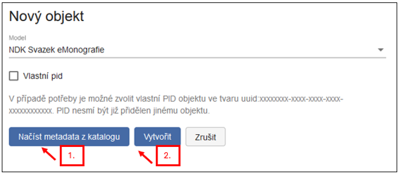
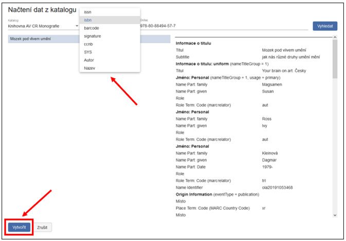
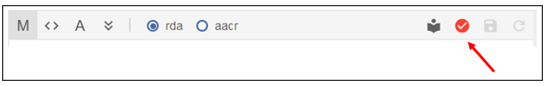
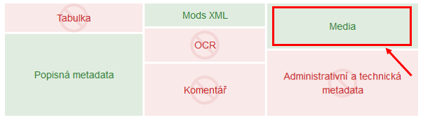
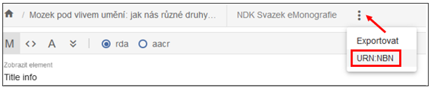

## 3.2 Born digital dokumenty (e-borny)

Dalším typem dokumentů, které je možné zpracovat v systému ProArc, jsou
tzv. born-digital či e-born digitální dokumenty. Tyto dokumenty už
vznikly elektronicky, v digitální podobě, není potřeba je digitalizovat
a v některých případech vůbec nemají svoji tištěnou listinnou podobu.
E-borny jsou nejčastěji ve formátu PDF, nebo EPUB.

### 3.2.1 NDK Svazek eMonografie

NDK Svazek eMonografie je model pro zpracování elektronické monografické
publikace, který je v souladu se standardy Národní knihovny ČR.

#### 3.2.1.1 Založení objektu

Po přihlášení do nového klienta ProArcu klikneme na horní záložku a
vybereme Nový objekt:

{width="6.267716535433071in"
height="1.2777777777777777in"}Po kliknutí na Nový objekt se objeví
tabulka. Z rozbalovací nabídky vybereme Model NDK Svazek eMonografie:

{width="6.267716535433071in"
height="2.9166666666666665in"}

Nový objekt je možné vytvořit dvěma způsoby:

1.  Načíst metadata z připojeného katalogu,

2.  založit jako prázdný pomocí tlačítka Vytvořit, v tomto případě
    musíte metadata vyplnit ručně.

{width="6.15625in"
height="2.6354166666666665in"}

Při načítání z katalogu je možné najít záznam ke zpracování podle
několika polí (SYSNO, ISBN, signatura, čárový kód, číslo ČNB, název
aj.):

{width="6.267716535433071in"
height="4.319444444444445in"}

Po vybrání správného záznamu je potřeba kliknout na tlačítko Vytvořit.
Objeví se nové „okno" -- formulář, do něhož se zkopírovala metadata ze
záznamu z katalogu:

{width="6.197916666666667in"
height="7.927083333333333in"}

Vyplněná data ve formuláři je vhodné zkontrolovat, proto doporučujeme
Vytvořit a přejít do objektu
{width="1.6875in"
height="0.3020833333333333in"}.

Pokud kliknete pouze na Vytvořit
{width="0.7291666666666666in"
height="0.3333333333333333in"}, eMonografii budete muset najít na
úložišti (např. podle modelu, názvu atd.).

V případě že ProArc upozorní na nevalidní data nic se neděje, objekt se
stejně uloží a na další obrazovce je možné formulář ještě dále
upravovat.

Zda jsou vyplněná data validní indikuje ikona v pravém horním rohu
panelu s metadatovým formulářem.

{width="6.267716535433071in"
height="0.8611111111111112in"}Pokud je tato ikona červená, formulář
obsahuje chybu. Pro snadné nalezení problematického elementu je možné si
rozkliknout rolovací nabídku s elementy, zde bude nevalidní element
označen červeně, např.:

{width="6.267716535433071in"
height="1.7361111111111112in"}

Poté, co zkontrolujete stažené údaje, můžete objekt uložit symbolem
diskety {width="0.3229166666666667in"
height="0.3020833333333333in"} . Doporučujeme zkontrolovat např. Fyzický
popis, kde se občas chybně stahuje hodnota „print" namísto správného
„electronic" (vyberte z roletky).

#### 3.2.1.2 Přidání plného textu (PDF)

Tlačítkem {width="0.3229166666666667in"
height="0.3333333333333333in"} (Rozložení) v pravém horním rohu
obrazovky si uživatel nastavuje panely, se kterými chce pracovat.

{width="5.17742125984252in"
height="2.7007983377077864in"}

Kliknutím na blok v pravém kontrolním panelu můžete blok aktivovat nebo
deaktivovat, zeleně jsou označeny bloky aktivní, červeně neaktivní. Pro
přidání PDF je potřeba mít zobrazený panel „Media":

{width="6.267716535433071in"
height="1.8194444444444444in"}

Doporučujeme mít aktivovaný alespoň ještě jeden blok - například s
popisnými metadaty nebo Mods xml, abyste si byli jistí, zda PDF
přidáváte ke správnému dokumentu.

{width="6.267716535433071in"
height="2.75in"}

Pro přidání PDF je třeba na panelu Media kliknout na ikonu šipky
{width="0.23958333333333334in"
height="0.3229166666666667in"} , pojmenované "Načíst nový digitální
obsah" a vybrat PDF soubor z disku počítače. Oproti předchozím verzím, v
novém klientovi nemusíte nic ukládat, PDF se uloží samo.

V případě, že se spletete a načtete chybný digitální dokument, lze jej
smazat, načíst nový, případně s ním dále pracovat (např.
přiblížit/oddálit, generovat PDF/A).

#### 3.2.1.3 Přidělení urn:nbn

Pro export NDK PSP balíčků a archivních balíčků je přidělení povinné,
export ve starším formátu pro Krameria je možný bez přidělení urn:nbn.

Urn:nbn můžete dokumentu přiřadit přímo v editaci v úložišti, kde funkci
najdete na liště pod třemi tečkami:

{width="6.267716535433071in"
height="1.2222222222222223in"}

Další možností je přidělení v základním okně úložiště-hledání, kde je
funkce umístěná na lištách obou horizontálních podoken:

{width="4.53125in"
height="1.3051148293963255in"}

Po stisknutí tlačítka se zobrazí dialogové okno, kde v roletce můžete
vybrat registrátora. Registrátor se upřesňuje v konfiguraci ProArcu. Po
registraci dostanete zpětnou vazbu od resolveru:

{width="6.010416666666667in"
height="1.34375in"}

Urn:nbn je automaticky zapsáno do metadat mezi platné identifikátory
dokumentu.

V ProArcu je ošetřena zpětná vazba v případě, že omylem zaregistrujete
dokument opětovně.

#### 3.2.1.4 Export dokumentu, import do Krameria a archivace

Po přidělení urn:nbn je možné e-monografii exportovat jako NDK PSP. NDK
PSP balíček je primárně používán k importům do digitální knihovny
Kramerius s image serverem. NDK PSP balíčky se případně předávají do
Národní digitální knihovny (VISK, replikace).

NDK PSP balíček lze vyexportovat do lokálního adresáře nebo přímo do
Krameria. O cíli exportu rozhodujete v dialogovém okně volbou z rolovací
nabídky:

{width="6.114583333333333in"
height="2.5833333333333335in"}

Archivní balíčky se vytvářejí za účelem uložení dat na úložištích mimo
ProArc. Vyexportovat je lze obdobně jako NDK PSP balíček.

# Funkce v úložišti

## Nastavení uživatelského profilu

Volba „Profil" na navigační liště slouží k odhlášení z aplikace, ke
změně hesla a k osobnímu přizpůsobení aplikace. Toto přizpůsobení se
týká tří oblastí.

### Preferované hodnoty 

Zde zadané hodnoty by měly být ty, které nejčastěji používáme při výběru
z roletek, protože se v nich budou nabízet na prvních místech.

{width="2.2503138670166227in"
height="4.135994094488189in"}

### Rozbalení formuláře

Rozbalení formuláře je funkce, která zajistí pro zvolený model rozbalení
části formuláře „related items" při založení objektu, i když se do ní
nestáhly z katalogu žádné údaje (využívá se především při zpracování
článků).

Obecně platí, že prázdné elementy jsou ve formulářích jednotlivých
modelů sbalené, dají se však ručně rozbalit a vyplnit.

### Nastavení sloupců

Zde můžeme pro každou oblast aplikace, ve které jsou údaje uspořádány
v tabulce, vybrat sloupce, které chceme zobrazit.

V základní obrazovce ProArcu -- v úložišti/hledání -- můžeme vybrat
požadované sloupce samostatně pro horní i dolní okno (strom):

{width="3.768489720034996in"
height="5.273863735783027in"}

Stejná možnost se nabízí pro obrazovku

- editace v importu (tj. pro obrazovku paginace načteného dokumentu),

- editace již vytvořeného objektu v úložišti,

- správy procesů,

- fronty načítání ve správě procesů.

Toto lokální nastavení je vázané na přihlášeného uživatele a po
odhlášení zůstávají nastavené poslední uložené volby.
