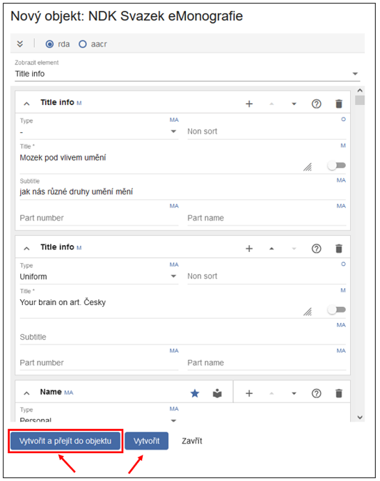
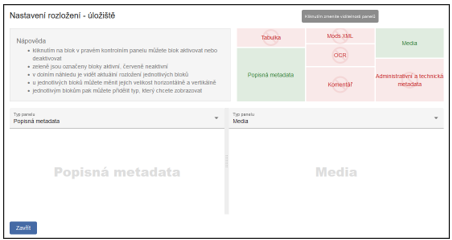
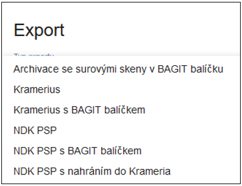
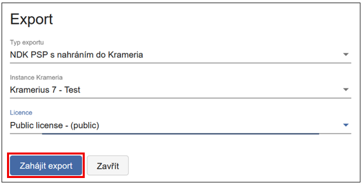

# NDK Svazek eMonografie

**Prohlédněte si krátký videonávod nebo projděte podrobný postup zpracování níže.**

!!! note "Videonávod"
    
---

# Podrobný popis zpracování NDK Svazku eMonografie

Digitální, nebo tzv. born-digital dokumenty (často označované jako
„e-borny"), jsou dokumenty, které vznikly přímo v elektronické podobě.
Tyto dokumenty už vznikly elektronicky, není potřeba je digitalizovat a
v některých případech vůbec nemají svoji tištěnou listinnou podobu.
Typickým příkladem jsou například elektronické knihy. Nejčastěji se
vyskytují ve formátech PDF, EPUB nebo PDF/A, který je vhodný pro
dlouhodobou archivaci.

Model **NDK Svazek eMonografie** je určen pro zpracování elektronické
monografické publikace jako samostatného dokumentu. Na rozdíl od
periodik nejde o opakovaně vydávaný titul, ale o uzavřený celek. Tento
model odpovídá standardům digitalizace stanoveným Národní knihovnou ČR.

## Založení objektu

Po přihlášení do nového klienta ProArcu klikněte na horní záložku a
zvolte **Nový objekt**:

Zobrazí se dialogové okno, ve kterém z rozbalovací nabídky vyberte model
**NDK Svazek eMonografie**.

Nový objekt můžete vytvořit dvěma způsoby:

1\. **Načtením metadat z** připojeného **katalogu**.

2\. Založením prázdného objektu pomocí tlačítka **Vytvořit**. V tomto
případě je potřeba metadata vyplnit ručně.

Při načítání z katalogu lze záznam vyhledat podle několika polí (např.
SYSNO, ISBN, signatura, čárový kód, číslo ČNB, název apod.).

Po výběru správného záznamu klikněte na **Vytvořit**. Otevře se nové
okno s formulářem, do kterého se automaticky zkopírují metadata
z katalogu:

!!! tip "Tip"
    Doporučujeme zvolit **Vytvořit a přejít do objektu**, abyste mohli metadata ihned zkontrolovat.  
    
    Pokud použijete pouze **Vytvořit**, je potřeba dokument později vyhledat v úložišti (např. podle modelu a názvu nebo např. kombinací modelu a identifikátoru).

V případě že ProArc upozorní na nevalidní data, objekt se přesto uloží.
Metadata můžete následně upravit v otevřeném formuláři.

!!! info "Povinnosti vyplnění formuláře jsou následující:"
    - **M** - mandatory (povinně plnit - element je součástí každého
    záznamu)
    - **MA** - mandatory if available (povinně plnit, pokud je to možné,
    pokud lze apod.)
    - **R** - recommended (plnění hodnot elementu je doporučeno, není ovšem
    povinné)
    - **RA** - recommended if available (doporučeno, pokud lze plnit)
    - **O** - optional (plnění hodnot elementu závisí na konkrétních
    potřebách instituce)

Validitu vyplněných dat indikuje ikona v pravém horním rohu panelu.
**Červená ikona** značí chybu ve formuláři. Pro snadnou identifikaci
chybných polí otevřete rolovací nabídku, kde budou chybné položky
označeny červeně:

Pokud je tato ikona červená, formulář obsahuje chybu. Pro snadné
nalezení problematického elementu je možné si rozkliknout rolovací
nabídku s elementy, zde bude nevalidní element označen červeně, např.
zde je chybně Origin info:

Po kontrole údajů dokument uložte pomocí ikony diskety.

!!! tip "Tip" 
    Doporučujeme zkontrolovat např. pole Fyzický popis, které se
    někdy chybně vyplní (stáhne) jako „print" namísto správné hodnoty
    „electronic" (lze upravit vybráním z rozbalovací nabídky).

## Přidání plného textu (PDF)

Pomocí tlačítka **Rozložení** v pravém horním rohu obrazovky si můžete
nastavit panely, se kterými chcete pracovat.

Bloky lze aktivovat nebo deaktivovat kliknutím na jejich názvy v pravém
kontrolním panelu. Zeleně označené bloky jsou aktivní. Červeně označené
bloky jsou neaktivní.

!!! warning "Upozornění" 
    Pro přidání PDF musí být aktivní panel **Média**.

!!! tip "Tip"
    Doporučujeme aktivovat i některý z panelů s Popisnými
    metadaty, příp. MODS XML, abyste si ověřili, že přidáváte PDF k
    odpovídajícímu dokumentu.

Výchozí stav bez nahraného plného textu je znázorněn na obrázku -
prázdná obrazovka se žlutě podbarveným upozorněním „Žádný digitální
obsah".

Pro přidání PDF je třeba na panelu Média kliknout na ikonu šipky,
pojmenované **Načíst nový digitální obsah** a následně vybrat PDF soubor
z disku počítače.

V nové verzi klienta není třeba PDF samostatně ukládat - dokument se
uloží automaticky.

Pokud omylem načtete nesprávný soubor, můžete ho smazat, nahradit jiným
nebo s ním dále pracovat (např. přiblížení, generování PDF/A).

## Přidělení URN:NBN

Přidělení URN:NBN je povinné pro export dokumentů ve formátu NDK PSP a
archivních balíčků.

URN:NBN lze přidělit dvěma způsoby:

1\. Přímo v editaci objektu v úložišti - funkce se nachází v nabídce
pod ikonou se třemi tečkami:

2\. V základním okně úložiště - hledání, kde je funkce umístěná na
lištách obou horizontálních podoken:

Po kliknutí na tlačítko **URN:NBN** pro přidělení se otevře dialogové
okno. Zde v rozbalovacím seznamu zvolte příslušného registrátora, který
je určen v konfiguraci systému ProArc.

Po úspěšné registraci obdržíte zpětnou vazbu přímo od Resolveru.

Identifikátor URN:NBN se automaticky zapíše do metadat jako jeden z
platných identifikátorů dokumentu.

ProArc je navíc vybaven ochranou proti duplicitní registraci. V případě,
že se pokusíte zaregistrovat dokument znovu, systém na tuto skutečnost
upozorní a další registraci neprovede.

## Export dokumentu, import do Krameria a archivace

Jakmile má dokument přidělený identifikátor URN:NBN, je možné jej
exportovat jako balíček ve formátu NDK PSP.

Balíček NDK PSP je určen zejména pro importy do Digitální knihovny
(systém Kramerius) využívající image server. V některých případech je
také předáván do Národní digitální knihovny v rámci projektů VISK nebo
pro potřeby replikace.

Export je možný:

- do lokálního adresáře,

- nebo přímo do Krameria.

Cíl exportu zvolíte v dialogovém okně výběrem z rozbalovací nabídky:

Pokud je to v konfiguraci instance ProArcu umožněno, můžete data odeslat
přímo do Krameria. V případě, že máte více instancí Krameria, v tomto
dialogovém okně můžete vybrat konkrétní instanci, stejně tak zvolit
licenci, pod jakou bude dokument zpřístupněn. Po nastavení všech
parametrů klikněte na **Zahájit export**. Např.:

Archivní balíčky slouží pro dlouhodobé uložení dokumentů na externí
úložiště mimo ProArc. Jejich vytvoření a export probíhá obdobně jako u
balíčků NDK PSP - v nabídce exportu pouze zvolte jiný typ:
**Archivace**.
