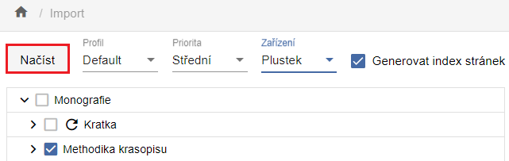

# Základní postup při zpracování Monografie

## Textové dokumenty

Textovými dokumenty zde rozumíme dokumenty založené na zpracování skenů
předloh, zahrnujeme mezi ně tedy i hudebniny (notové zápisy) a
kartografické dokumenty.

### NDK svazek monografie

NDK svazek monografie je v souladu se standardy Národní digitální
knihovny (dále NDK) výhradně jednosvazkové dílo.

#### Vytvoření digitálního dokumentu (objektu)

V navigační liště úložiště zvolíme „Nový objekt". Otevře se dialogové
okno shodné pro zakládání všech modelů (typů dokumentů):

{width="6.268055555555556in"
height="2.60625in"}

- Model -- v roletce si vybereme typ objektu, který chceme vytvořit. V
  nabídce jsou typy dokumentů dle standardů Národní digitální knihovny i
  pro dokumenty, které standard zatím nemají popsán (modely STT, kroniky
  apod.).

- Vlastní PID - určeno pro případy, kdy je nutné opravit nebo doplnit
  dokument, který v ProArcu není, ale je již v DK. Příklad bude uveden
  v budoucí kapitole o speciálních importních funkcích.

- Nové objekty primárně zakládáme stažením dat z katalogu, ale tlačítkem
  „Vytvořit" lze otevřít prázdný formulář a metadata zadat manuálně.

{width="6.268055555555556in"
height="1.2381944444444444in"}

V roletkách tohoto dialogu vybereme zdrojový katalog, údaj, podle,
kterého chceme záznam vyhledat a odpovídající hodnotu (název, ISBN ...)

Před vlastním založením objektu lze metadata upravit v náhledu
formuláře:

{width="5.887028652668416in"
height="6.24249343832021in"}

Volbou „Vytvořit a přejít do objektu" (resp. „Vytvořit") systém objekt
uloží do databáze.

Systém hlídá povinná pole v souladu se standardy NDK. Pokud pole s
označením M (Mandatory) není vyplněno, objekt se neuloží a chybná pole
se červeně označí.

{width="3.899701443569554in"
height="1.8670636482939633in"}

Po případné opravě a úspěšném uložení objektu nás systém přepne přímo do
editačního okna („Vytvořit a přejít do objektu") nebo do úložiště
(„Vytvořit"), odkud se do editace dostaneme dvojklikem na objektu. Zde
můžeme pracovat s metadaty již vytvořeného objektu.

{width="6.268055555555556in"
height="3.7694444444444444in"}

Šíři podoken lze měnit tažením myší. Jejich uspořádání v editaci je
velmi variabilní, lze si je upravit kdykoli během práce. Provádí se
pomocí ikony vpravo na liště:

{width="6.261111111111111in"
height="0.26944444444444443in"}

Zobrazení nového objektu v editaci v úložišti výše odpovídá tomuto
rozložení podoken:

{width="6.268055555555556in"
height="4.611111111111111in"}

#### Načtení dat 

S uživatelem v ProArcu jsou svázány pracovní adresáře, o jejich
namapování uživatele informuje administrátor.

- Do adresáře určeného k importu připravíme skeny ve formátu TIFF, k nim
  vytvořené OCR soubory ve formátu TXT a ALTO soubory (ve formátu XML).
  Pro NDK modely NELZE importovat tiffy bez OCR a ALTO.

- V levé části navigační lišty ProArcu zvolíme tlačítko „Import" a
  přejdeme tak do importní obrazovky.

{width="6.263888888888889in"
height="1.98125in"}

- Zde vybereme adresář s daty dokumentu, který chceme zpracovávat

- Vybereme „Profil načítání" podle zpracovávaného modelu. V případě NDK
  modelů pro textové dokumenty použijeme profil „Default". Další profily
  budou popsány se souvisejícími procesy.

- „Priorita" je defaultně nastavena na hodnotu „Střední". Zvolením vyšší
  priority můžeme načítaný soubor předřadit ve frontě souborům s nižší
  prioritou, jinak se zařadí na její konec.

- „Zařízením" se rozumí přístroj, na kterém byla načítaná data
  připravena -- typicky je jím skener. Pro většinu modelů je zařízení
  povinné, teprve po jeho výběru se aktivuje tlačítko „Načíst"

- Funkce „Generovat index stránek" je defaultně zapnuta, postará se
  přiřazení indexů stranám dokumentu již při načítání.

- Ikona {width="0.31454943132108487in"
  height="0.27754374453193353in"} slouží k opětovnému načtení již
  načtené dávky (z různých důvodu je někdy potřeba opět načíst tutéž
  dávku dokumentů - např. vadný soubor apod.). ProArc v importním
  adresáři vytváří pomocné soubory, které je potřeba smazat před
  opětovným načtením -- tato ikona soubory automaticky promaže.

- Je možné vybrat pro import i více dávek najednou - dávky se řadí do
  fronty a načítají se postupně.

Po spuštění načítání můžeme v případě jedné dávky sledovat v dialogovém
okně postup načítání. Toto okno je možné zavřít a načítání bude probíhat
dále na pozadí. Stav lze sledovat ve Správě importních procesů:

{width="4.250592738407699in"
height="1.7294083552055992in"}

V případě souběžného spuštění více dávek přejdeme rovnou do Správy
importních procesů a vybereme „Zobrazit frontu načítání"

{width="4.265458223972003in"
height="2.0375185914260716in"}

Zde pak vidíme průběh načítání v tabulkovém zobrazení, stav lze
aktualizovat tlačítkem „Obnovit".

{width="6.268055555555556in"
height="1.675in"}

Je-li načítání ukončeno, proces z tohoto zobrazení zmizí a je zapotřebí
přejít „Zpět na seznam všech procesů". Zde označíme načtenou dávku ke
zpracování -- na liště se objeví tlačítka „Načíst znovu" a „Pokračovat":

{width="6.254861111111111in"
height="1.7166666666666666in"}

#### Popis obrazových dat (paginace)

Volbou „Pokračovat" po načtení se dávka otevře v okně „Správa dávek --
editace". I tady lze podokna uspořádat pomocí ikony
{width="0.16978346456692914in"
height="0.15480205599300087in"}

{width="6.268055555555556in"
height="2.4347222222222222in"}

- Každé podokno má na horní liště svou sadu použitelných funkcí, při
  posunu myši na ikonu se zobrazí popis funkce.

- Rozložení a výběr zobrazovaných sloupců lze změnit v okně „Profil"
  [[4.1.3]{.underline}](#_heading=h.26in1rg).

- Změníme-li ve formuláři popis jedné strany, po stisknutí ENTER se
  změna uloží a automaticky se přesuneme na další stranu

{width="6.263888888888889in"
height="4.934027777777778in"}

Hromadné paginování lze provést označením bloku myší nebo pomocí kláves
SHIFT/CTRL a nastavením parametrů popisu ve formuláři. Pro uložení změn
je nutné použít klávesu ENTER nebo ikonu diskety.

Ve chvíli, kdy jsou všechny objekty popsány povinným elementem (v tomto
případě číslem strany), použijeme tlačítko „Pokračovat". Proběhne
validace a pokud nejsou všechny strany očíslovány, objeví se informace o
chybě a chybná strana je červeně podbarvena kvůli snazší identifikaci.

{width="3.2087806211723535in"
height="2.073206474190726in"}

Po opravě a úspěšné validaci otevře tlačítko „Pokračovat" obrazovku pro
výběr nadřazeného objektu, tj. titulu, k němuž patří naimportované a
popsané strany:

{width="6.268055555555556in"
height="3.0729166666666665in"}

Pro zkrácení seznamu k výběru zadáme patřičný model a blíže určíme titul
např. částí názvu. V horní části okna vybereme ze seznamu cílový objekt
a po uložení můžeme objekt buď otevřít rovnou v editoru úložiště nebo si
jej najdeme v hlavním okně úložiště.

{width="4.625645231846019in"
height="1.9586067366579178in"}

#### Úprava (editace) dokumentu

Zobrazení v editoru je stejné, jako v případě nově založeného objektu
(viz kap. 3.1.1.1 ), nyní ale můžeme vidět i seznam přiřazených stran a
jejich náhledy. Můžeme upravovat metadata jak pro strany, tak na úrovni
titulu, a to ve formuláři i přímo v XML.

Při každé provedené změně se aktivuje jinak zašedlá ikona diskety a
změnu je zapotřebí jejím stiskem uložit.

Také zde má každé podokno lištu s řadou funkcí, jejich popis se zobrazí
po najetí myší na ikonu. Méně používané funkce jsou skryté pod třemi
tečkami.

{width="6.268055555555556in"
height="0.3958333333333333in"}

Podokno se zobrazenými stranami (ať už ve formě tabulky nebo dlaždic)
umožňuje strany nebo jejich skupiny přesouvat na nové pozice v rámci
dokumentu -- myší nebo pomocí funkce „Změnit pozici"

Pokud se nacházíme na úrovni podřízených objektů (zde stran), na úroveň
nadřazeného objektu nejsnáze přejdeme kliknutím na odkaz s názvem titulu
na liště:

{width="6.263888888888889in"
height="4.131944444444445in"}

#### Přidělení urn:nbn

Abychom mohli zpracovanou dávku exportovat pro zveřejnění v DK či
archivaci, měli bychom jí přidělit urn:nbn. Pro export NDK PSP balíčků a
archivních balíčků je přidělení povinné, export ve starším formátu pro
Krameria je možný bez urn:nbn.

Urn:nbn můžeme dokumentu přidělit přímo v editaci v úložišti, funkce je
skrytá na liště pod třemi tečkami:

{width="6.263888888888889in"
height="0.38680555555555557in"}

{width="1.2397561242344708in"
height="1.0939031058617672in"}

Další možností je přidělení v základním okně úložiště, kde je funkce
umístěná na lištách obou horizontálních podoken:

{width="5.896527777777778in"
height="0.49027777777777776in"}

Po stisknutí tlačítka se zobrazí dialogové ono, kde v roletce můžeme
vybrat registrátora. Nejčastěji bude k dispozici jeden, ale pokud
průběžně digitalizujeme i pro jinou instituci, která je sama
registrátorem a máme povoleno jejím jménem registrovat dokumenty, můžeme
ji mít v konfiguraci ProArcu.

{width="6.268055555555556in"
height="2.04375in"}

Po registraci dostaneme zpětnou vazbu od resolveru a urn:nbn je
automaticky zapsáno do metadat mezi platné identifikátory dokumentu:

{width="6.268055555555556in"
height="1.7555555555555555in"}

V ProArcu je ošetřena i zpětná vazba v případě, že omylem registrujeme
dokument opětovně nebo dojde k chybě.

#### Export dokumentu

ProArc nabízí řadu exportních formátů, případně jejich propojení
s externími systémy (digitálními knihovnami, úložišti ...). Není nutné
mít v nabídce všechny dostupné formáty, lépe je nabídku omezit
konfigurací konkrétní instance na potřebné varianty.

V této kapitole uvedeme pouze nejběžnější a nejvíce používané formáty.

Funkce Export je dostupná v editaci objektu v úložišti pod třemi tečkami
a v základním okně úložiště (viz analogie s umístěním funkce přidělení
urn:nbn v kap. [[3.1.1.5]{.underline}](#přidělení-urnnbn)).

Všechny druhy exportů se spouštějí jako procesy na pozadí a vytvářejí
frontu, kterou lze sledovat ve správě procesů. Dokumenty postupně
získávají statusy *export naplánován -\> exportování -\> exportováno*,
v horším případě *export skončil upozorněním* či dokonce *chyba
exportu*. Ve filtru pro pole Status nelze vybrat více hodnot, může tedy
být výhodné nastavit filtr na hodnotu „Vše".

{width="6.268055555555556in"
height="2.071527777777778in"}

##### NDK PSP balíček

NDK PSP balíček je primárně používán k importům do digitální knihovny
Kramerius s image serverem. Zároveň je formátem, ve kterém je nutno
předat data do Národní digitální knihovny (např. na základě zpracování
v projektu VISK) a ve kterém si knihovny mohou předávat data v rámci
replikací.

NDK PSP balíček můžeme vyexportovat do lokálního exportního adresáře
nebo přímo do nakonfigurované (napojené) instance Krameria. O cíli
exportu rozhodneme v dialogovém okně volbou z roletek.

{width="6.268055555555556in"
height="2.941666666666667in"}

##### Export pro Krameria

Export ve starším formátu „Kramerius" lze podobně jako u NDK PSP balíčku
směřovat do lokálního adresáře (viz obrázek) a pak jej ručně přemístit
k importu do Krameria, nebo jej lze odeslat přímo do Krameria, pokud je
tato varianta dostupná v naší konfiguraci.

{width="6.268055555555556in"
height="2.8291666666666666in"}

##### Archivace

Archivní balíčky se vytvářejí za účelem uložení dat na úložištích mimo
ProArc. K dispozici je několik variant, jak s archivním balíčkem
pracovat, zde zmíníme pouze základní formát:

{width="6.268055555555556in"
height="2.0347222222222223in"}

## 
