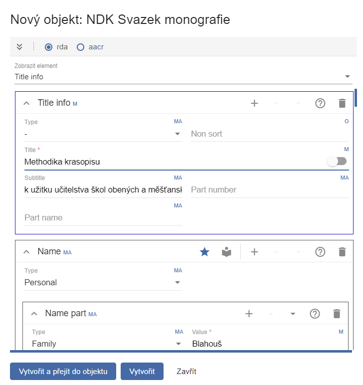
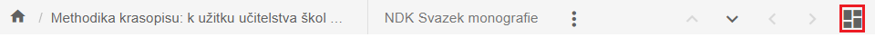
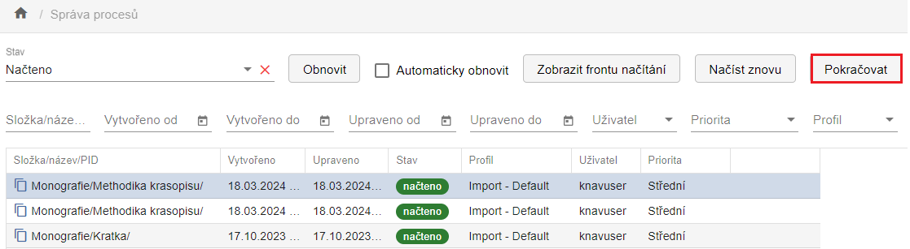
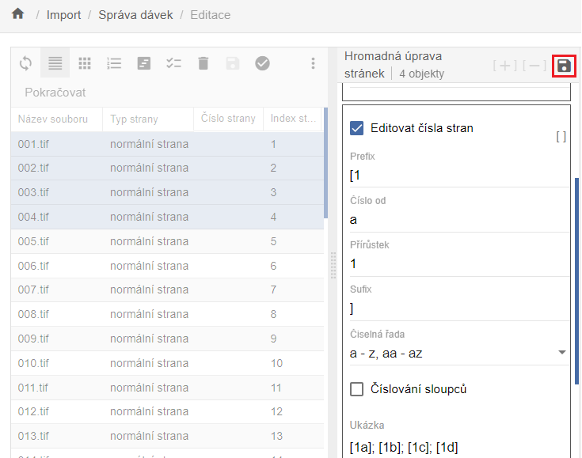
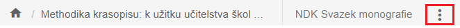
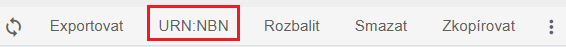
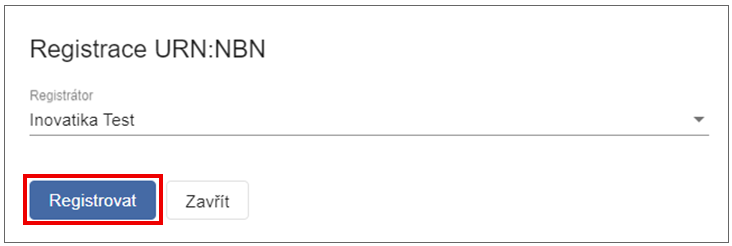

--- 
status: new
---

# NDK svazek monografie

NDK svazek monografie patří mezi textové dokumenty - tedy díla vzniklá
digitalizací tištěných nebo ručně psaných předloh. Do této skupiny
spadají mimo jiné také hudebniny (notové zápisy) a kartografické
dokumenty.

Podle [standardů Národní digitální knihovny
(NDK)](https://standardy.ndk.cz/ndk/standardy-digitalizace/DMF_monografie_2.2_final_17_12_24.pdf)
je tento model definován jako výhradně jednosvazkové dílo.

## Vytvoření digitálního dokumentu (objektu)

V navigační liště úložiště klikněte na možnost **Nový objekt**.

Zobrazí se dialogové okno, které slouží pro založení všech typů
dokumentů (modelů).

**Model** - V rozbalovací nabídce vyberte typ objektu, který chcete
vytvořit. K dispozici jsou modely odpovídající standardům NDK, včetně
typů, které zatím nemají detailní specifikaci (např. modely STT, kroniky
aj.).

**Vlastní PID** - Tato možnost slouží v případech, kdy je potřeba
doplnit nebo opravit dokument, který není v systému ProArc, ale již
existuje v Digitální knihovně.

Nové objekty se standardně zakládají stažením dat z katalogu. V
roletkách tohoto dialogu vyberete zdrojový katalog, údaj, podle, kterého
chcete záznam vyhledat a odpovídající hodnotu (již konkrétní název, ISBN
aj.) a zvolte **Vyhledat**.

Pokud ale potřebujete zadat metadata ručně, lze otevřít prázdný formulář
pomocí tlačítka **Vytvořit**. Před samotným založením objektu lze
metadata upravit v náhledu formuláře:

Pro uložení objektu použijte možnost **Vytvořit a přejít do objektu**
(nebo pouze **Vytvořit**). Systém následně uloží objekt do databáze.

Systém automaticky kontroluje vyplnění povinných polí podle standardů
NDK. Pokud některé pole označené jako **M (Mandatory)** není vyplněno,
uložení nebude umožněno a chybná pole budou zvýrazněna červeně.

!!! info "Ostatní povinnosti vyplnění formuláře jsou následující:" 
    - **M** - mandatory (povinně plnit - element je součástí každého záznamu)
    - **MA** - mandatory if available (povinně plnit, pokud je to možné, pokud lze apod.)
    - **R** - recommended (plnění hodnot elementu je doporučeno, není ovšem povinné)
    - **RA** - recommended if available (doporučeno, pokud lze plnit)
    - **O** - optional (plnění hodnot elementu závisí na konkrétních potřebách instituce)

!!! tip "Tip" 
  
    K vyplňování metadat můžete využít [Pravidla pro popis monografií](https://standardy.ndk.cz/ndk/standardy-digitalizace/ppp_mono_2.3_final_17_12_24.pdf).

Po úspěšném uložení a případné opravě budete přesměrováni následovně:

- Zvolíte-li **Vytvořit a přejít do objektu**, otevře se rovnou editační
  okno daného objektu.
- Zvolíte-li **Vytvořit**, vrátíte se zpět do úložiště. Editaci objektu
  poté otevřete dvojklikem.

V editačním prostředí dále pracujte s metadaty právě vytvořeného
objektu.

Šířku jednotlivých podoken lze upravovat tažením myši. Rozvržení lze
přizpůsobit kdykoli během práce. Úpravy provádějte pomocí ikony v pravé
části horní lišty:

Zobrazení nově vytvořeného objektu v editačním prostředí odpovídá tomuto
výchozímu rozložení podoken (Tabulka, Popisná metadata, Obrázek):

## Načtení dat 

Každý uživatel má v ProArcu přiřazeny pracovní adresáře. O jejich
namapování informuje uživatele systémový administrátor.

Do adresáře určeného pro import připravte:

- skeny ve formátu **TIFF**,
- k nim odpovídající **OCR soubory ve formátu TXT**,
- a **ALTO soubory ve formátu XML**.

!!! warning "Upozornění" 
  
    Pro NDK modely není možné importovat TIFF soubory bez odpovídajících OCR a ALTO souborů.*

Pro zahájení importu klikněte v levé části navigační lišty ProArcu na
tlačítko **Import**. Tím přejdete do importního rozhraní.

V importním rozhraní vyberte adresář s daty dokumentu, který chcete
zpracovat.

V poli **Profil** načítání zvolte profil podle typu modelu. Pro textové
dokumenty v NDK modelech použijte profil **Default**.

**Priorita** je ve výchozím stavu nastavena na **Střední**. Zvolíte-li
vyšší prioritu, bude se dávka ve frontě zpracovávat dříve než ostatní.
Jinak se zařadí na konec fronty.

V poli „**Zařízení**" vyberte přístroj, na kterém byla data připravena
(typicky je jím **skener**). Výběr zařízení je pro většinu modelů
povinný. Tlačítko **Načíst** se aktivuje až po jeho zvolení.

Funkce **Generovat index stránek** je ve výchozím stavu zapnutá.
Zajišťuje automatické přiřazení indexů stránkám již během načítání.

Ikona  slouží k opětovnému
načtení dávky, např. v případě vadného souboru. Před novým načtením
ProArc automaticky smaže pomocné soubory, které při předchozím importu
vytvořil.

Lze také vybrat více dávek najednou - dávky se zařadí do fronty a
zpracují se postupně.

Po spuštění načítání se v případě jedné dávky zobrazí dialogové okno s
průběhem importu. Toto okno můžete **Zavřít** - načítání bude i nadále
probíhat na pozadí.

Aktuální stav importu můžete sledovat ve **Správě importních procesů**.
V případě souběžného spuštění více dávek budete automaticky přesměrováni
do **Správy importních procesů**. Zde klikněte na možnost **Zobrazit
frontu načítání**.

V tabulkovém zobrazení uvidíte průběh importu jednotlivých dávek.\
Aktuální stav lze ručně aktualizovat pomocí tlačítka **Obnovit**.

Jakmile je načítání dokončeno, daný proces zmizí z aktuálního
zobrazení.\
Je proto nutné kliknout na možnost **Zpět na seznam všech procesů**.

V přehledu procesů označte dokončenou dávku, čímž se v horní liště
zpřístupní tlačítka:

- **Načíst znovu** - pro opětovný import dávky,
- **Pokračovat** - pro zahájení dalšího zpracování.

> 

## Popis obrazových dat (paginace)

Po kliknutí na tlačítko **Pokračovat** se načtená dávka otevře v okně
**Správa dávek - editace**.

Také zde lze uspořádat podokna dle potřeby pomocí ikony pro změnu
rozložení zobrazení .

Každé podokno v rozhraní **Správa dávek - editace** má v horní liště
vlastní sadu funkcí.\
Při najetí myší na jednotlivé ikony se zobrazí jejich popis.

Rozložení zobrazení a výběr viditelných sloupců můžete upravit v okně
**Profil**.

Pokud změníte popis u konkrétní strany, změna se uloží po stisknutí
klávesy **ENTER**. Kurzor se poté automaticky přesune na další stranu.

Pro hromadné označení více stran použijte myš nebo klávesy SHIFT/CTRL.
Nastavte parametry popisu ve formuláři a změny potvrďte klávesou
**ENTER** nebo kliknutím na ikonu diskety:

Jakmile jsou všechny strany popsány povinným elementem (např. číslem
strany), klikněte na tlačítko **Pokračovat**. Systém provede validaci
záznamů.

Pokud některé strany chybí nebo obsahují chybu, zobrazí se upozornění a
problémové strany budou červeně zvýrazněny pro snadnou identifikaci.

Po úspěšné validaci se otevře okno pro výběr nadřazeného objektu, tedy
titulu, k němuž patří právě popsané a importované strany.

Pro zúžení seznamu vyberte příslušný model a doplňte například část
názvu titulu. V horní části okna označte požadovaný cílový objekt. Po
uložení máte opět dvě možnosti - otevřít objekt rovnou v editoru
úložiště, vyhledat jej později v hlavním okně úložiště.

## Úprava (editace) dokumentu

Zobrazení objektu v editoru odpovídá tomu, které znáte z nově založeného
objektu. Navíc je zde nyní dostupný seznam přiřazených stran spolu s
jejich náhledy.

Můžete upravovat metadata na úrovni jednotlivých stran, i na úrovni
titulu - a to jak ve **formuláři**, tak přímo v **XML** zobrazení.

Po provedení jakékoli změny se aktivuje (již dříve zašedlá) ikona
diskety. Pro uložení změn je nutné na tuto ikonu kliknout.

Každé podokno obsahuje lištu s funkcemi, jejichž popis se zobrazí při
najetí myší na ikonu. Méně často používané funkce jsou skryty pod ikonou
tří teček:

V podokně se zobrazenými stranami (tabulkové nebo dlaždicové zobrazení)
lze přesouvat jednotlivé strany nebo jejich skupiny na jiné pozice v
rámci dokumentu, přesun lze provést buď myší, nebo pomocí funkce
**Změnit pozici**. Nacházíte-li se na úrovni podřízených objektů (např.
stran), můžete se na úroveň nadřazeného objektu (např. titulu) vrátit
kliknutím na název titulu v horní liště editoru:

## Přidělení URN:NBN

Aby bylo možné zpracovanou dávku exportovat pro zveřejnění v Digitální
knihovně (Kramerius) nebo pro archivaci, je nutné přidělit URN:NBN.

1\. URN:NBN lze přidělit přímo v editoru úložiště. Funkce je dostupná na
liště pod ikonou tří teček:

2\. Druhou možností přidělení URN:NBN je v základním okně úložiště.
Funkce je umístěna na lištách obou horizontálních podoken:

Po kliknutí na příslušné tlačítko se zobrazí dialogové okno, ve kterém v
rozbalovacím poli (roletce) zvolte registrátora. Ve většině případů bude
k dispozici jeden registrátor.

Pokud ale digitalizujete i pro jinou instituci, která je registrátorem,
a máte oprávnění registrovat dokumenty jejím jménem, může být v seznamu
dostupná i ona - záleží na konfiguraci ProArcu.

Po úspěšné registraci obdržíte zpětnou vazbu od resolveru. Identifikátor
URN:NBN je automaticky zapsán do metadat dokumentu jako platný
identifikátor:

V ProArcu je ošetřena i situace, kdy omylem provedete opakovanou
registraci téhož dokumentu, nebo dojde k technické chybě - systém vrátí
odpovídající chybovou hlášku.

## Export dokumentu

ProArc podporuje řadu exportních formátů a umožňuje i napojení na
externí systémy - např. digitální knihovny nebo repozitáře.

Není však nutné mít v rozhraní dostupné všechny formáty.

!!! tip "Tip"
    Doporučujeme nabídku omezit konfigurací konkrétní instance pouze na ty formáty, které daná instituce skutečně využívá.

Funkce **Export** je dostupná v editoru objektu v úložišti pod ikonou
tří teček, a také v základním okně úložiště.

### NDK PSP balíček

NDK PSP balíček slouží primárně k importům do digitální knihovny
Kramerius (s využitím image serveru), předávání dat do Národní digitální
knihovny (např. v rámci projektu VISK), případně k replikaci dat mezi
knihovnami.

Export NDK PSP balíčku lze provést do lokálního exportního adresáře,
nebo přímo do napojené instance Krameria, pokud je tato možnost
nakonfigurována.

Cílové umístění exportu zvolte v dialogovém okně pomocí roletky.

