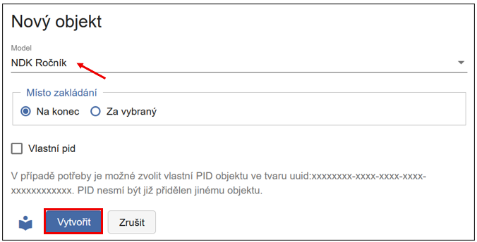
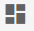
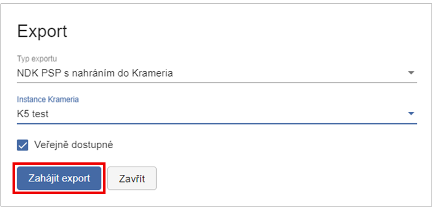

# NDK Periodikum 

**Prohlédněte si krátký videonávod nebo projděte podrobný postup zpracování níže.**

!!! note "Videonávod"
    <iframe 
    width="640" 
    height="360" 
    src="https://drive.google.com/file/d/1W15g_IJqyJGeWGhgWbUpn5bfQhDI_iVU/preview"
    allow="autoplay; encrypted-media" 
    frameborder="0" 
    allowfullscreen>
    </iframe>
    
---

Periodikum je dokument vydávaný opakovaně v samostatných částech, které
spojuje společný název, průběžné číslování nebo jiné posloupnosti,
jednotná grafická úprava a tematické zaměření. Tyto části vycházejí v
pravidelných nebo nepravidelných intervalech, a jejich vydávání je
plánováno jako dlouhodobé nebo neukončené. Typickými příklady periodik
jsou noviny, časopisy nebo periodické sborníky.

V katalogových záznamech jsou periodika rozpoznatelná podle hodnoty
**"s"** v poli **LDR/07**, která označuje **seriál** (dokument
vydávaný průběžně).  
Tato hodnota odlišuje periodika od monografií (`LDR/07 = "m"`) a je
rozhodující pro výběr odpovídajícího modelu v rámci zpracování v
ProArcu.

## Vytvoření digitálního dokumentu (objektu)

V navigační liště úložiště klikněte na **Nový objekt**. Otevře se
dialogové okno pro vytvoření všech typů dokumentů (modelů). Níže
popisujeme jednotlivé modely využívané pro zpracování periodik. Než
začnete zakládat konkrétní ročníky a čísla, je nejprve potřeba založit
titulovou úroveň periodika, až poté následně strukturu periodika.

### NDK Periodikum

#### Nové NDK Periodikum

Než začnete s vytvářením nového objektu periodika, doporučujeme nejprve
ověřit, zda už periodikum v systému neexistuje. Klikněte na **Hledat** v
horní liště (Import, Správa procesů, Hledat, Nový objekt).

Pomocí **Pokročilého vyhledávání** můžete najít titul podle modelu (NDK
Periodikum), názvu, identifikátoru (např. UUID, ISSN a dalších).
Jestliže požadovaný titul nenajdete, pokračujte jeho založením.

Pokud zakládáte úplně nové periodikum (v ProArcu ještě nikdy nebylo
založeno), založení je následující. Jako první krok v navigační liště
úložiště klikněte na možnost **Nový objekt**. 

Zobrazí se dialogové okno, které slouží pro založení všech typů dokumentů (modelů). Z roletky
vyberte model **NDK Periodikum**.

Objekt lze založit dvěma způsoby:

- **Vytvořit** - otevře se prázdný formulář a metadata se vyplňují
  ručně (nedoporučujeme).

- **Načíst metadata z katalogu** - doporučený postup. Po kliknutí na
  toto tlačítko se otevře další dialog, kde zvolíte katalog, typ
  hledaného údaje (např. název, pole 001, ISSN, čárový kód) a konkrétní dotaz.

!!! tip Tip
    Periodikum hledejte podle pole `001` nebo `sysno`, dostanete nejrelevantnější výsledek.

Kliknutím na **Vyhledat** se zobrazí výsledky. Vlevo se zobrazí seznam
nalezených titulů (názvy periodik). Vpravo se zobrazí doplňující
informace - katalogový záznam ve formátu MARC21. Řádek, který je
zašedlý (vlevo, v seznamu periodik), označuje záznam, který bude po
potvrzení stažený do formuláře. Záznam vyberete kliknutím na
**Vytvořit**, čímž se metadata přenesou do formuláře a připraví k
editaci.

Systém ProArc kontroluje povinná pole. Pokud není některé pole označené
jako **M (Mandatory)** vyplněno, zobrazí se červeně. Při zakládání
titulové úrovně jde nejčastěji o chybějící signaturu - **Uložení**.

Pokud chcete metadata doplňovat a upravovat až později, klikněte na
**Uložit**. Zobrazí se vám sice tato hláška o nevalidních datech, ale
objekt se i přes chybějící údaje uloží a vytvoří:

Metadata se tímto způsobem automaticky přenesou do formuláře. Objekt
vytvoříte kliknutím na **Vytvořit a přejít do objektu** nebo jen
**Vytvořit** (objekt se uloží, ale musíte ho cíleně najít přes hlavní
obrazovku, v úložišti).

Zvolíte-li variantu **Vytvořit**, nově vytvořené periodikum najdete
z hlavní obrazovky (**Hledat** 🡪 **Pokročilé vyhledávání** nebo
**Dotaz**, specifikujte model NDK Periodikum). Dvojklikem na název
periodika se dostanete do editačního rozhraní.

Po uložení (**Vytvořit a přejít do objektu**) se dostanete do editačního
rozhraní, kde můžete pracovat s metadaty titulové úrovně. Červená ikona
vás opět upozorňuje na chybně vyplněná metadata:

!!! tip "Tip"
    K vyplňování metadat využijte [Pravidla pro popis periodik](https://standardy.ndk.cz/ndk/standardy-digitalizace/ppp_perio_8.6_final_17_12_24.pdf).

Uspořádání podoken v editaci je variabilní a lze jej kdykoli upravit
pomocí ikony vpravo na liště.

!!! tip "Tip na rozložení obrazovky"
    Tabulka (případně Strom), Popisná metadata Obrázek.

#### NDK Periodikum s existujícím uuid 

Druhá možnost vytvoření objektu titulové úrovně nastává v situaci, kdy
byl původní titul už smazán (např. po archivaci a zálohování), ale stále
existuje v digitální knihovně. V tomto případě lze vytvořit nový objekt
s již existujícím UUID.

V horní liště klikněte na **Nový objekt**, z roletky vyberte model **NDK
Periodikum**. Zaškrtněte možnost **Vlastní PID**. Dialogové okno se
rozšíří o jeden řádek (PID), kam můžete vložit již existující UUID
(např. z digitální knihovny) ve tvaru uuid:... PID nesmí být přidělen
jinému objektu v instanci. Díky tomuto kroku se vám nově zakládané
ročníky a čísla propojí s existujícím periodikem v DK (Kramerius).

Dále pokračujete stejným způsobem jako u nového objektu založeného bez
existujícího UUID (PID) - načtením metadat z katalogu a úpravou
formuláře, stažením a případnou ruční úpravou (např. doplnění
signatury).

### NDK Ročník

Ročník zakládáme nejlépe z editačního prostředí NDK Periodika, a to
pomocí ikony **Plus**.

Po kliknutí na **Plus** přidáte nový objekt (ročník). Při zakládání
můžete zvolit, zda se má přidat **Na konec**, nebo **Za vybraný** ročník
(ten je aktuálně podbarvený).

!!! tip "Tip na rozložení" 
    Tabulka nebo Strom (případně kombinace) s Popisnými metadaty a doplňkově i Obrázek.

Nejdůležitějšími poli jsou: Číslo části (titleInfo/partNumber) a Datum
vydání (originInfo/dateIssued). Ostatní metadata (např. žánr s hodnotou
volume nebo UUID) se vyplní automaticky.

Další ročník přidáte opět ikonou **Plus**. Místo zakládání lze zvolit
dvojí - buďto **Na konec** nebo **Za vybraný**. Vybraný je ten ročník,
který je podbarvený:

Pokud ročník založíte na nesprávném místě, lze ho přesunout, máte dvě
možnosti:

- **Přetažením myší** - přetáhněte objekt na požadovanou pozici. Po
  přesunutí obrazovka zešedne - pro její opětovné zaktivnění klikněte
  na ikonu **diskety (Uložit)**.

- Nebo s využitím funkce **Změna pozice** - najdete ji v nabídce pod
  třemi tečkami.

V případě, že se rozhodnote použít funkci změny pozice, po jejím zvolení
se zobrazí dialog, kde do pole **Pozice** zadáte číslo určující pozici,
kam se má objekt přesunout (v ukázce v rozmezí 1-4, protože máme
založeny 4 ročníky) a potvrdit kliknutím na **Přesunout**.

{width=500}

Ročník se přesune na vámi vybrané místo. Jakmile obrazovka zašedne, je
potřeba ještě změnu uložit ikonou **diskety**. Obnovit zobrazení lze
ikonou **obousměrných šipek**, obrazovky se poté znovu zaktivní a lze
pokračovat v práci.

### NDK Číslo

Číslo se zakládá stejným způsobem jako ročník - kliknutím na ikonu
**Plus**. Je však důležité, aby bylo založeno **uvnitř správného
ročníku**.

K orientaci v hierarchii slouží: drobečková navigace a zobrazení
Stromu/Tabulky.

**Drobečková navigace** - ukazuje, kde se právě nacházíte, a umožňuje
snadné přepínání/proklik mezi jednotlivými úrovněmi (např. periodikum →
ročník → číslo).

Zobrazení **Tabulky**, či ještě lépe **Stromu** také poskytuje přehled
celkové struktury periodika:

Pokud se nenacházíte na úrovni ročníku, můžete se do něj dostat
dvojklikem na jeho název. Poté lze založit nové číslo pomocí ikony
**Plus**.

Pro rychlý přesun mezi objekty využijte šipky:

↑ (na nadřazený objekt), ↓ (na podřazený objekt), ← (na předchozí
objekt), → (na následující objekt).

## Načtení dat 

Každý uživatel má v ProArcu přiřazeny pracovní adresáře. O jejich
namapování informuje uživatele systémový administrátor.

Do adresáře určeného pro import připravte: skeny ve formátu **TIFF**, k
nim odpovídající **OCR soubory ve formátu TXT** a **ALTO soubory ve
formátu XML**.

!!! warning "Upozornění"
    Pro NDK modely není možné importovat TIFF soubory bez odpovídajících OCR a ALTO souborů.

Pro zahájení importu klikněte v levé části navigační lišty ProArcu na
tlačítko **Import**. Tím přejdete do importního rozhraní.

V importním rozhraní vyberte adresář s daty dokumentu, který chcete
zpracovat.

V poli **Profil** načítání zvolte profil podle typu modelu. Pro textové
dokumenty v NDK modelech použijte profil **Default**.

**Priorita** je ve výchozím stavu nastavena na **Střední**. Zvolíte-li
vyšší prioritu, bude se dávka ve frontě zpracovávat dříve než ostatní.
Jinak se zařadí na konec fronty.

V poli **Zařízení** vyberte přístroj (**skener**), na kterém byla data
připravena. Výběr zařízení je pro většinu modelů povinný. Tlačítko
**Načíst** se aktivuje až po jeho zvolení.

Funkce **Generovat index stránek** je ve výchozím stavu zapnutá.
Zajišťuje automatické přiřazení indexů stránkám již během načítání.

Ikona  slouží k opětovnému načtení
dávky. Při novém načtení ProArc automaticky smaže pomocné soubory, které
při předchozím importu vytvořil.

Lze také vybrat více dávek najednou - dávky se zařadí do fronty a
zpracují se postupně. Po spuštění načítání se v případě jedné dávky
zobrazí dialogové okno s průběhem importu. Toto okno můžete **Zavřít**
- načítání bude i nadále probíhat na pozadí.

{.bordered}

Aktuální stav importu můžete sledovat ve **Správě importních procesů**.
V případě souběžného spuštění více dávek budete automaticky přesměrováni
do **Správy importních procesů**. Zde klikněte na možnost **Zobrazit
frontu načítání**.

{.bordered}

V tabulkovém zobrazení uvidíte průběh importu jednotlivých dávek.  
Aktuální stav lze ručně aktualizovat pomocí tlačítka **Obnovit**.

Jakmile je načítání dokončeno, daný proces zmizí z aktuálního
zobrazení.  
Je proto nutné kliknout na možnost **Zpět na seznam všech procesů**.

V přehledu procesů označte dokončenou dávku, čímž se v horní liště
zpřístupní tlačítka:

- **Načíst znovu** - pro opětovný import dávky,

- **Pokračovat** - pro zahájení dalšího zpracování.

## Popis obrazových dat (paginace)

Po kliknutí na tlačítko **Pokračovat** se načtená dávka otevře v okně
**Správa dávek - editace**.

Rozhraní je rozděleno na více podoken, která si můžete libovolně
uspořádat podle svých potřeb pomocí ikony pro změnu **rozložení zobrazení**  (vpravo nahoře).

Každé podokno má v horní liště vlastní **sadu funkcí**. Při najetí myší
na jednotlivé ikony se zobrazí jejich popis. **Výběr sloupců** lze
přizpůsobit v horní liště pod ikonou **tří teček (Více)**, případně v
nastavení v sekci **Profil**.

Rozložení je individuální - každému může vyhovovat něco jiného.  

!!! tip "Tip"
    Doporučujeme minimálně zobrazit následující podokna: **Náhledy, Tabulka** nebo **Strom, Popisná metadata** a **Obrázek.**

Na ukázce níže jsou zobrazena podokna: **Náhledy**, **Popisná metadata**
a **Obrázek**:

V případě, že máte čísla svázaná dohromady do jednoho svazku, je dobré
si načíst celý svazek, ten očíslovat, opaginovat, doporučujeme také
popsat typ strany Titulní strana (titlepage), pro snadnější orientaci
při rozřazování do čísel, a všechny popsané skeny nejlépe uložit do
prvního čísla.

Pokud změníte popis u konkrétní strany, změna se uloží po stisknutí
klávesy **ENTER**. Kurzor se poté automaticky přesune na další stranu.

Pro hromadné označení více stran použijte myš nebo klávesy SHIFT/CTRL.
Nastavte parametry popisu ve formuláři a změny potvrďte klávesou
**ENTER** nebo kliknutím na ikonu diskety:

Jakmile jsou všechny strany popsány povinným elementem (např. číslem
strany), klikněte na tlačítko **Pokračovat**. Systém provede validaci
záznamů.

Pokud některé strany chybí nebo obsahují chybu, zobrazí se upozornění a
problémové strany budou červeně zvýrazněny pro snadnější identifikaci.

Po úspěšné validaci se otevře okno pro výběr nadřazeného objektu, tedy
titulu, k němuž patří právě popsané a importované strany.

## Úprava (editace) dokumentu

Zobrazení v editoru je stejné, jako v případě nově založeného objektu.
Navíc zde vidíme i seznam přiřazených stran a jejich náhledy. Metadata
lze upravovat jak pro jednotlivé strany, tak i na úrovni titulu, ročníku
a čísla - a to jak pomocí formuláře, tak přímo v XML zobrazení.

!!! warning "Upozornění"
    Změníte-li údaje u titulové úrovně periodika po vytvoření ročníků a čísel, metadata se nepropíšou do již hotových objektů (ročníků, čísel).

Při každé provedené změně se aktivuje jinak zašedlá ikona diskety -
změnu je nutné **Uložit** (symbol **diskety**).

Každé podokno má na horní liště vlastní sadu funkcí. Po najetí kurzorem
na ikonu se zobrazí její popis. Méně často používané funkce jsou skryté
pod ikonou **tří teček**.

Podokno se zobrazenými stranami (ve formě tabulky nebo náhledů) umožňuje
jednotlivé strany nebo **více vybraných stran** přesouvat na nové pozice
v rámci dokumentu - buď přetažením myší, nebo přes funkcionalitu
**Změnit pozici**.

Nacházíte-li se v úrovni podřízených objektů (např. strany), můžete se
**vrátit na nadřazenou úroveň** kliknutím na odkaz s názvem v horní
navigační liště (proklik je možný na titul, ročník i číslo):

Případně šipkou nahoru (**Přejít na nadřazený objekt**):

Pokud byla všechna čísla naskenována do jednoho souboru (např. kvůli
svázání v rámci ročníku), je třeba jednotlivé skeny **přesunout ke
správnému číslu nebo ročníku**. Postup přesunu je následující:

1.  V úložišti vyhledejte titul, ke kterému jsou skeny připojeny.

2.  Otevřete editační okno objektu.

3.  Ve struktuře klikněte na první číslo, v němž jsou skeny uložené.

4.  V levé části označte skeny určené k přesunu (po výběru budou
    podbarvené).

5.  Klikněte na ikonu **šipky doprava** (ikona pro přesun).

Poté:

6.  Vyhledejte a vyberte cíl přesunu.

!!! tip "Tip"
    Pro zúžení seznamu vyberte příslušný model a doplňte například část názvu titulu.

7.  Podbarvené skeny zkontrolujte (podbarvené se budou přesunovat).

8.  Klikněte na **Přesunout**. V pravé horní části okna označte
    požadovaný cílový objekt (klikněte na název periodika - podbarví
    se, ročník - rozbalí se, a vyberte cílové číslo - zvýrazní se
    podbarvením). Nad tlačítkem **Přesunout** se zobrazuje informace o
    cílovém objektu (Přesunout objekty do).

Po kliknutí na **Přesunout** se zobrazí potvrzovací dialog „Přesun
objektů - Opravdu chcete přesunout vybrané objekty do nově zvoleného
objektu?" Potvrďte kliknutím na **Ano**.

{width=500}

Skeny se tímto přesunou do správné úrovně (např. konkrétní číslo). Po
přesunu to vypadá takto:

!!! warning "Upozornění"
    Přesun objektů není omezen pouze na nejnižší úroveň (např. jednotlivé stránky/skeny). Přesouvat lze také celé výtisky nebo ročníky. Dbejte proto zvýšené opatrnosti a vždy si pečlivě zkontrolujte, jaký objekt přesouváte a kam ho umísťujete.

Tímto způsobem skeny rozřadíte do jednotlivých (předem založených)
čísel. Po rozřazení a přesunutí všech skenů do jednotlivých čísel je
ještě potřeba každé číslo zreindexovat pomocí **Reindexovat** na horní
liště:

Po kliknutí na tlačítko se zobrazí dialog, ve kterém stačí potvrdit akci
kliknutím na **Ano** - tím potvrdíte, že chcete reindexovat všechny
strany daného čísla.

{width=400}

## Přidělení URN:NBN

Přidělování URN:NBN závisí na zvoleném způsobu zpracování.

Pokud zpracováváte celé ročníky, URN:NBN přidělujete na úrovni
**ročníku**. V případě postupného zpracování po jednotlivých číslech,
přidělujte URN:NBN každému **číslu** samostatně.

Funkce přidělení URN:NBN je dostupná buď přímo z editačního rozhraní
objektu (pod ikonou tří teček),

nebo ze základního okna úložiště klinknutím na tlačítko **URN:NBN**.
Objekt, který se bude exportovat je vždy podbarvený (v ukázce výtisk
1/2017):

Po stisknutí tlačítka se zobrazí dialogové okno, ve kterém vyberte v
roletce registrátora. Nejčastěji bude k dispozici jeden, ale můžete jich
mít více, výběr závisí na konfiguraci systému.

Po úspěšné registraci dostanete zpětnou vazbu od Resolveru a
identifikátor je automaticky zapsáno do metadat jako platný.

## Export dokumentu

ProArc podporuje řadu exportních formátů a umožňuje i napojení na
externí systémy - např. digitální knihovny nebo repozitáře.

Není však nutné mít v rozhraní dostupné všechny formáty.

!!! tip "Tip" 
    Doporučujeme nabídku omezit konfigurací konkrétní instance pouze na ty formáty, které daná instituce skutečně využívá.

Funkce **Export** je dostupná v editoru objektu v úložišti pod ikonou
tří teček, a také v základním okně úložiště.

K importům do digitální knihovny Kramerius (s využitím image serveru), předávání dat do Národní digitální knihovny (např. v rámci projektu VISK), případně k replikaci dat mezi knihovnami slouží primárně NDK PSP balíček.

Export NDK PSP lze provést do lokálního exportního adresáře,
nebo přímo do napojené instance Krameria, pokud je tato možnost
nakonfigurována.

Cílové umístění exportu zvolte v dialogovém okně pomocí roletky.

{width=500}
