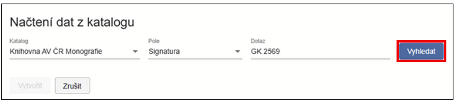
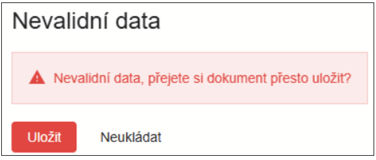
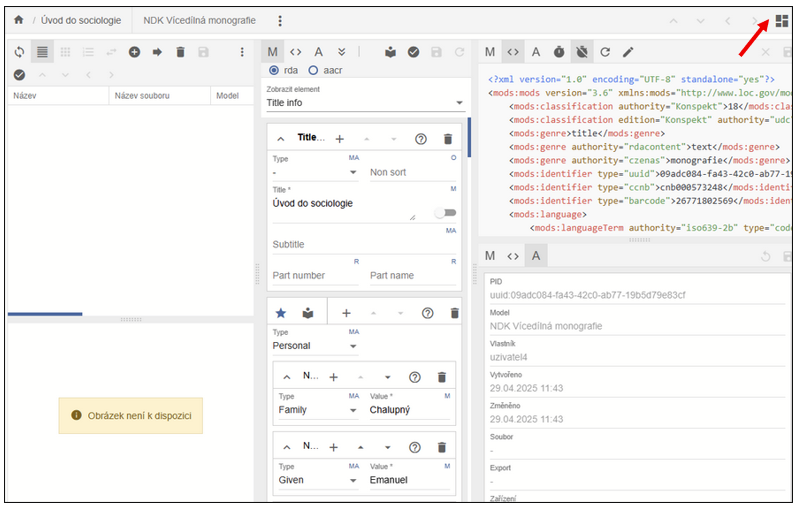
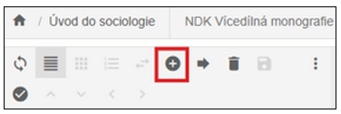
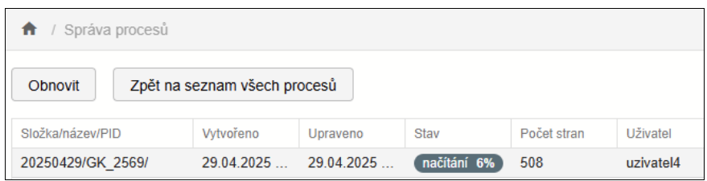
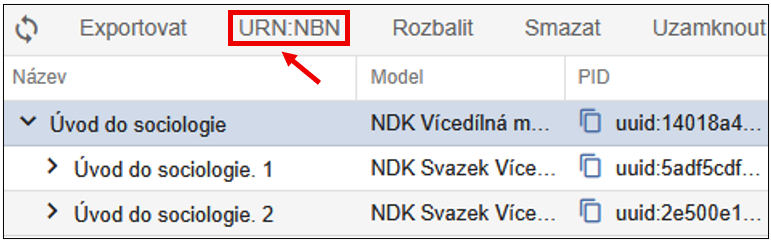

# NDK Vícedílná monografie

Vícedílná monografie by se dala ve zkratce definovat tím, že musí
obsahovat dvě úrovně popisu: titul vícedílné monografie a více
jednotlivých svazků (dílů).

Aby bylo možné titul zpracovat jako vícedílnou monografii podle
standardů NDK, musí katalogizační záznam obsahovat přesně definovanou
kombinaci hodnot v polích MARC21.  
Pouhá přítomnost číslování v poli `245`
nestačí - rozhodující jsou hodnoty v poli `LDR: LDR/07 =   "m"` (označuje
monografii), `LDR/19 =   "a"` (označuje vícedílný dokument).

## Vytvoření digitálního dokumentu (objektu)

V systému ProArc je tedy potřeba nejprve založit titulový objekt
vícedílné monografie (hlavní úroveň), pod něj přidat jednotlivé svazky
jako podřízené objekty (dílčí úrovně). Tyto úrovně odpovídají logickému
členění publikace a musí být zohledněny při importu, popisu i následném
exportu.

V navigační liště úložiště klikněte na možnost **Nový objekt**. Otevře
se dialogové okno určené pro zakládání všech typů dokumentů (modelů).

Z roletky modelů vyberte typ objektu model **NDK Vícedílná monografie**
- ten představuje **titulovou úroveň** celé monografie. Tato úroveň
bude nadřazená jednotlivým svazkům (dílům), které přidáte následně.

!!! tip "Tip"
    Doporučujeme využít **funkci pro načtení metadat z katalogu** - tím se předejde ručnímu vyplňování a zajistí se správné naplnění povinných polí podle standardů NDK.

{width=600}

Nejprve zvolte katalog a kritérium vyhledávání (např. **signatura**,
**ISBN**, **číslo ČNB** apod.). Zadejte hledaný výraz a potvrďte
kliknutím na tlačítko **Vyhledat**.

{width=600}

Zobrazí se katalogový záznam ve formátu MARC21. Pokud odpovídá vašemu
hledanému dokumentu, klikněte na **Vytvořit**.

Před samotným založením objektu je možné metadata upravit v náhledu
formuláře.  

Zvolte jednu z možností:

- **Vytvořit a přejít do objektu** - objekt se uloží a rovnou otevře v
  editačním režimu,

- **Vytvořit** - objekt se uloží do úložiště, do editace se dostanete
  později dvojklikem z hlavní obrazovky.

Systém automaticky kontroluje povinná pole. Pokud některé pole označené
jako povinné - **M (Mandatory)** chybí, objekt se neuloží. Chybějící
položky se zvýrazní červeně.

{width=400}

Po úspěšném uložení budete přesměrováni buďto do editačního okna (při
volbě **Vytvořit a přejít do objektu**), nebo do úložiště, odkud můžete
objekt upravit dvojklikem (**Vytvořit**).

Rozvržení editační obrazovky je flexibilní - jednotlivá okna lze
zvětšovat tažením myší.  
Uspořádání panelů upravíte pomocí ikony v pravém horním rohu.

Pro práci s vícedílnou monografií doporučujeme rozložení, ve kterém
vpravo vidíte **Stromovou strukturu** dokumentu (hlavní titul a
podřízené části), uprostřed **Popisná metadata** a vlevo máte zobrazení
**Tabulky**:

Kliknutím na **ikonu plus (+)** přidáte nový, podřízený objekt, tedy
svazek (díl) monografie.

Opět se otevře dialogové okno shodné pro zakládání všech modelů (typů
dokumentů). Výběr modelu je přednastaven na ten, u něhož se předpokládá,
že sem patří (v případě NDK Vícedílné monografie je to **Svazek
Vícedílné monografie**).

Zvolte **pozici**, kam se nový objekt ve struktuře vloží: **Na konec**,
nebo **Za vybraný** (nový svazek se vloží za aktuálně označený).

{width=600}

Opět si můžete vybrat mezi:

- **Načtením metadat z katalogu** (doporučeno) 💡

- **Ručním vyplněním** prázdného formuláře

Po vytvoření záznamu zkontrolujte a případně upravte metadata. Zejména
doplňte číslo části (Part number) a název části (Part name) - pokud je
známo.

!!! tip "Doporučujeme"
    Nejprve založit všechny svazky pomocí volby Vytvořit, a teprve poté provádět další editace.

{width=600}

Vpravo vidíte **Strom** - stromovou strukturu zakládaného objektu,
prozatím je vytvořen pouze první svazek vícedílky:

Pokud nový svazek nezakládáte načtením z katalogu, systém automaticky
přebere některé údaje z nadřazené úrovně (v souladu se standardem NDK).
Povinné údaje, které je potřeba doplnit ručně, jsou označeny červeně v
rozbalovacím seznamu elementů, např.:

{width=600}

Pořadí svazků lze upravit dvěma způsoby:

1. **Přetažením** **myší** - přetáhněte objekt na požadované místo,
obrazovka zešedne jako by se lehce zamlží, změnu uložte pomocí ikony
**diskety**.

2. **Změna pozice** - v nabídce pod ikonou tří teček vyberte Změna
pozice, do pole Pozice zadejte cílové pořadí (např. 2), potvrďte
kliknutím na **Přesunout**. Následně změnu **uložte**.

## Načtení dat

Každý uživatel má v systému ProArc přiřazen pracovní adresář. O jeho
namapování informuje administrátor.

Do importního adresáře je třeba připravit následující soubory: skeny
dokumentu ve formátu **TIFF**, k nim příslušné **OCR soubory** ve
formátu **TXT** a a **ALTO soubory** ve formátu **XML**.

!!! warning "Upozornění"
    Pro modely NDK není možné importovat TIFF soubory bez odpovídajících OCR a ALTO dat.

Postup načtení dat je následovný: V levé části horní navigační lišty
klikněte na tlačítko **Import**, tím otevřete importní obrazovku.

Vyberte adresář obsahující data dokumentu určeného k načtení. Zvolte
**Profil** načítání podle typu modelu. Pro textové dokumenty dle modelu
NDK použijte profil **Default**.

Nastavte další volby importu:

- **Priorita:** Výchozí hodnota je **Střední**. Vyšší priorita způsobí,
  že se dávka zpracuje přednostně.

- **Zařízení:** Označuje zařízení, na kterém byla data připravena (např.
  skener). Po jeho výběru se aktivuje tlačítko **Načíst**.

- **Generovat index stránek:** Funkce je ve výchozím stavu aktivní.
  Stránky budou při importu automaticky očíslovány.

- Ikona obnova načítání (šipka) slouží k opětovnému načtení již
  zpracované dávky. Před opětovným načtením je nutné odstranit pomocné
  soubory vytvořené v importním adresáři - tato funkce je automaticky
  odstraní.

Průběh načítání jedné dávky: Po spuštění se zobrazí dialogové okno s
průběhem importu. Okno je možné zavřít, proces bude pokračovat na
pozadí. Stav lze průběžně sledovat v sekci **Správa procesů**.

{width=400}

Průběh načítání více dávek: K importu lze označit a načíst **více dávek
najednou** - dávky se následně řadí do fronty a zpracovávají se
postupně. Pro sledování stavu přejděte rovnou do Správy importních
procesů a klikněte na **Zobrazit frontu načítání**.

{width=400}

Zobrazí se tabulka s průběhem importu, kterou je možné aktualizovat
tlačítkem **Obnovit**.

{width=600}

Po dokončení načítání daný proces zmizí z aktuálního zobrazení.  
Pro další zpracování přejděte na **Seznam všech procesů**, kde je
potřeba dávku označit. Poté se v liště zaktivní tlačítka **Načíst
znovu** (pro opětovné načtení dávky), a **Pokračovat** (pro pokračování
ve zpracování dat).

## Popis obrazových dat (paginace)

Po načtení dávky klikněte na tlačítko **Pokračovat**. Dávka se otevře v
okně **Správa dávek - editace**. Každé podokno obsahuje vlastní
nástrojovou lištu s funkcemi. Popis funkce se zobrazí po najetí myší na
příslušnou ikonu.

Pracovat lze se zobrazením náhledů skenů:

nebo s řádkovým zobrazením:

Oboje možnosti zobrazení lze podle potřeby přepínat na liště.

Po úpravě popisu konkrétní strany potvrďte změnu klávesou **ENTER** -
automaticky se přesunete na následující stranu.

Pro rychlejší práci lze provést **hromadné paginování**:

1.  Označte blok stran pomocí myši nebo kombinace kláves **SHIFT /
    CTRL** (vybrané strany budou podbarvené).

2.  V pravé části formuláře nastavte potřebné parametry popisu (např.
    čísla stran).

3.  Pro uložení změn použijte klávesu **ENTER** nebo ikonu **diskety**.

Jakmile jsou všechny objekty popsány povinnými elementy (např. číslem
strany), klikněte na **Pokračovat**. Systém provede **validaci dat**.

Pokud některé strany nejsou správně očíslovány, zobrazí se chybové
hlášení. Chybné záznamy budou **červeně zvýrazněny** pro snadnější
identifikaci.

Po opravě chyb a úspěšné validaci pokračujte opět tlačítkem
**Pokračovat**, čímž otevřete obrazovku pro výběr **nadřazeného
objektu** (titulu), ke kterému patří importované a popsané strany.

Při výběru nadřazeného objektu (titulu) je dobé zúžit výběr zadáním
modelu a třeba části názvu titulu. V horní části okna se zobrazí seznam
odpovídajících titulů, ze kterého vyberte cílový objekt a potvrďte volbu
**Uložit**.

Poté je třeba je ještě kliknout na **Ano** odsouhlasit potvrzující
dialog:

Následně se skeny začnou ukládat:

Po uložení se zobrazí tato hláška. Zde klikněte na **Otevřít
v editoru**.

{width=400}

## Úprava (editace) dokumentu

Zobrazení objektu v editoru je totožné jako v případě [nově založeného
objektu](#vytvoreni-digitalniho-dokumentu-objektu). Rozdíl spočívá v tom, že
nyní vidíte i seznam přiřazených stran a jejich náhledy.

Metadata lze upravovat jak na úrovni stran, tak na úrovni titulu,  
a to buď ve formulářovém režimu, nebo přímo v XML. Jakákoli změna
aktivuje (jinak zašedlou) ikonu **diskety**, kterou je třeba stisknout
pro **uložení změn**.

I v tomto případě platí, že každé podokno má vlastní nástrojovou lištu.
Popis jednotlivých funkcí se zobrazí při najetí myší na příslušnou
ikonu. Méně často používané funkce jsou skryté pod ikonou tří teček.

Podokno se zobrazením stran umožňuje přepnutí mezi tabulkovým zobrazením
a dlaždicemi (náhledy), přesunovat jednotlivé strany nebo celé skupiny
na jiné pozice v rámci dokumentu, a to tažením myší, nebo pomocí funkce
**Změnit pozici**.

Pokud se nacházíte na úrovni podřízených objektů (např. stran), lze se
snadno vrátit zpět na nadřazený objekt kliknutím na název titulu v horní
liště editoru, případně využít „šipky" **Přejít na nadřazený objekt**.

## Přesunutí skenů do jiného objektu

Pokud byly všechny díly vícedílné monografie (např. 2 svazky)
naskenovány do jednoho souboru, např. kvůli společnému svázání, je nutné
přesunout skeny do odpovídajících svazků.

Přesun mezi svazky je možný takto: V hlavním okně úložiště vyhledejte
titul, ke kterému byly skeny přiřazeny.

Dvojklikem na název titulu otevřete editační okno objektu. Ve struktuře
objektu klikněte na konkrétní svazek, do kterého byly skeny původně
uloženy (nejčastěji první díl).

V levém panelu označte skeny, které chcete přesunout a klikněte na ikonu
**Přesunout** (šipka):

Otevře se okno pro výběr cíle přesunu. Vyhledejte a označte cílový
svazek, do kterého mají být vybrané skeny přesunuty. Skeny připravené k
přesunu budou podbarvené pro snadnější kontrolu.

V zobrazeném dialogovém okně zkontrolujte zvolený cíl. Pro kontrolu je
nad tlačítky Zrušit vazbu a Přesunout i slovně název svazku, do něhož se
budou skeny přesunovat. Klikněte na tlačítko **Přesunout**, tím dojde k
přesunu vybraných skenů do cílového svazku vícedílné monografie.

Po kliknutí na **Přesunout** se zobrazí potvrzovací dialog „Přesun
objektů - Opravdu chcete přesunout vybrané objekty do nově zvoleného
objektu?" Potvrďte kliknutím na **Ano**.

## Přidělení URN:NBN

Abychom mohli zpracovaný dokument exportovat pro zveřejnění v Digitální
knihovně (DK) nebo pro archivaci, je nutné mu přidělit URN:NBN.

URN:NBN můžete přidělit dvěma způsoby:

  - 1) V editačním režimu objektu - funkci najdete v pravém horním
rohu pod ikonou **tří teček.** Po kliknutí se zobrazí nabídka, kde
zvolíte přidělit **URN:NBN.**

  - 2) V základním okně úložiště - funkce je dostupná na horní liště obou
horizontálních podoken.

Po stisknutí tlačítka se zobrazí dialogové okno. V rozbalovacím seznamu
zvolte registrátora. Většinou bude dostupný pouze jeden. Po potvrzení
požadavku proběhne komunikace se službou Resolveru.

Přidělené URN:NBN se automaticky zapíše do metadat mezi platné
identifikátory dokumentu.

ProArc podporuje i zpětnou vazbu: Pokud omylem registrujete dokument
znovu, nebo dojde k chybě při registraci, zobrazí se odpovídající
hlášení.

!!! warning "Důležité"
    URN:NBN nelze přidělit objektu, který nemá přiřazené skeny.

## Export dokumentu

Funkce **Export** je dostupná (obdobně jako export URN:NBN) přímo v
**editačním režimu objektu** - pod ikonou **tří teček**, nebo **v
základním okně úložiště**.

Export se spouští jako proces na pozadí. Exporty jsou řazeny do fronty,
kterou lze sledovat ve **Správě procesů.**

K importům do digitální knihovny, k replikaci dat a k předávání dat do
Národní digitální knihovny (např. VISK) slouží primárně **NDK PSP
balíček**.

Export NDK PSP balíčku lze provést do lokálního exportního adresáře,
nebo přímo do napojené instance Krameria, pokud je tato možnost
nakonfigurována.

Cílové umístění exportu zvolte v dialogovém okně pomocí roletky.

{width=500}
