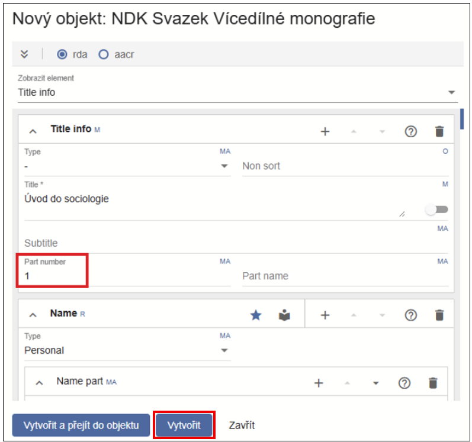
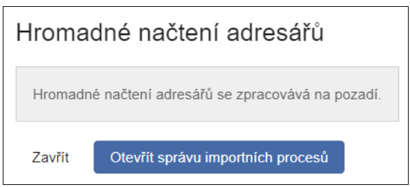
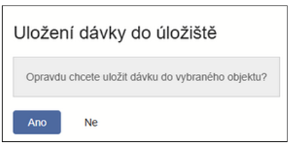
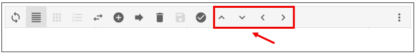
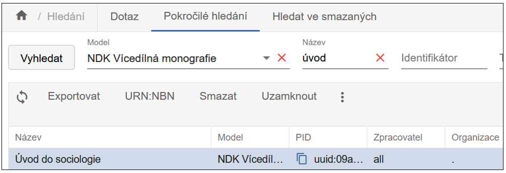
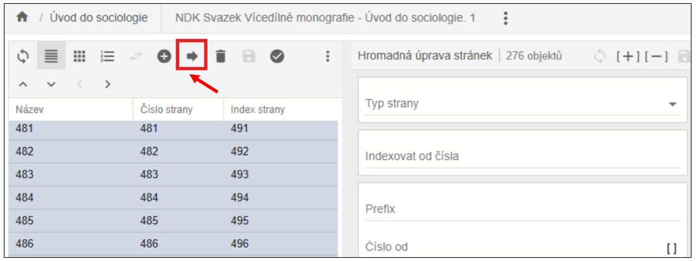
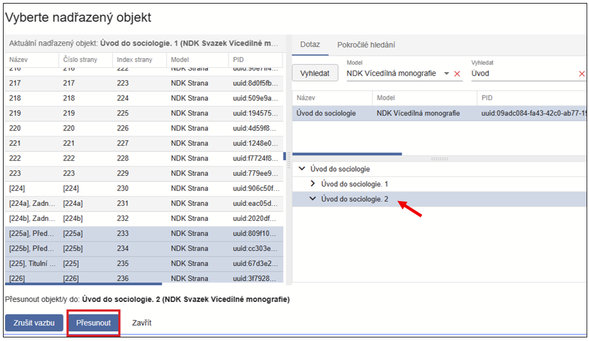
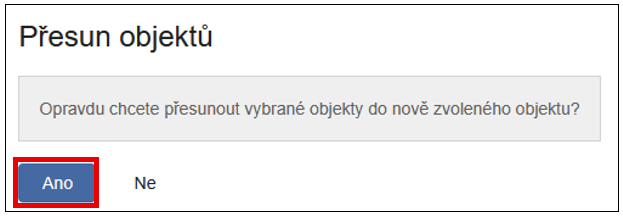

### 3.1.2 Vícedílná monografie

Vícedílná monografie by se dala ve zktrace definovat tím, že musí
obsahovat dvě úrovně popisu: titul vícedílné monografie a typicky více
jednotlivých svazků (dílů). V NDK standardu jsou jasně definované
hodnoty, které musí být obsaženy v katalogizačním záznamu, aby se dalo
říci, že jde o vícedílnou monografii:

- kombinace těchto hodnot v polích MARC21: **LDR/07="m" a zároveň
  LDR/19="a"**

- hodnota issuance = **multipart monograph**

Je tedy nutné vytvořit nejprve jeden záznam pro celý titul vícedílné
monografie a hierarchicky pod ním záznamy jednotlivých svazků.

Příklad, jak vypadá již zpracovaná vícedílná monografie, prezentovaná v
systému Kramerius:
[[https://kramerius.lib.cas.cz/uuid/uuid:3966d0bb-ff73-46ac-a3c2-585f34da0580]{.underline}](https://kramerius.lib.cas.cz/uuid/uuid:3966d0bb-ff73-46ac-a3c2-585f34da0580)

#### 3.1.2.1 Vytvoření digitálního dokumentu (objektu)

V navigační liště úložiště zvolíme „Nový objekt".

{width="6.267716535433071in"
height="0.4444444444444444in"}

Otevře se dialogové okno stejné pro zakládání všech modelů (typů
dokumentů):

{width="6.267716535433071in"
height="3.138888888888889in"}

Vybereme nadřazenou úroveň tj. NDK Vícedílnou monografii.

{width="6.267716535433071in"
height="2.7083333333333335in"}

- Model -- v roletce si vybereme typ objektu, který chceme vytvořit. V
  nabídce jsou typy dokumentů dle standardů NDK i pro dokumenty, které
  standard zatím nemají popsán (modely STT, kroniky apod.).

- Vlastní PID - určeno pro případy, kdy je nutné opravit nebo doplnit
  dokument, který v ProArcu není, ale je již v DK. Příklad bude uveden
  v budoucí kapitole o speciálních importních funkcích.

- Nové objekty primárně zakládáme stažením dat z katalogu, ale tlačítkem
  „Vytvořit" lze otevřít prázdný formulář a metadata zadat manuálně.

Vybereme si z možností, podle kterých lze vyhledávat v příslušném
katalogu (např. zde vyhledáváme podle
signatury){width="6.267716535433071in"
height="2.6666666666666665in"}

Zadáme vyhledávací dotaz a potvrdíme kliknutím na pole "Vyhledat"

{width="6.267716535433071in"
height="2.013888888888889in"}

Objeví se katalogový záznam ve formátu MARC21. Výběr záznamu potvrdíme
tlačítkem "Vytvořit"

{width="6.267716535433071in"
height="5.180555555555555in"}

Před vlastním založením objektu lze metadata upravit v náhledu
formuláře:

{width="6.267716535433071in"
height="6.694444444444445in"}

Volbou „Vytvořit a přejít do objektu" (resp. „Vytvořit") systém objekt
uloží do databáze.

Systém hlídá povinná pole v souladu se standardy NDK. Pokud pole s
označením M (Mandatory) není vyplněno, objekt se neuloží a chybná pole
se červeně označí.

{width="4.270833333333333in"
height="1.9479166666666667in"}

Po případné opravě a úspěšném uložení objektu nás systém přepne přímo do
editačního okna („Vytvořit a přejít do objektu") nebo do úložiště
(„Vytvořit"), odkud se do editace dostaneme dvojklikem na objektu. Zde
můžeme pracovat s metadaty již vytvořeného objektu.

{width="6.267716535433071in"
height="4.263888888888889in"}

Šíři podoken lze měnit tažením myší. Jejich uspořádání v editaci je
velmi variabilní, lze si je upravit kdykoli během práce. Provádí se
pomocí ikony vpravo na liště:

{width="6.267716535433071in"
height="0.25in"}

{width="6.267716535433071in"
height="4.805555555555555in"}

Pro popis vícedílné monografie doporučujeme následující rozložení oken,
kde je v pravé části vidět strom, v němž bude znázorněna struktura
celého dokumentu (tedy titul vícedílné monografie a pod ním jednotlivé
svazky, případně další vnitřní části a strany):

{width="6.267716535433071in"
height="4.833333333333333in"}

Kliknutím na "+" přidáme nový, podřízený objekt, kterým musí být v tomto
případě NDK Svazek Vícedílné monografie

{width="6.267716535433071in"
height="3.7777777777777777in"}

Opět se otevře dialogové okno shodné pro zakládání všech modelů (typů
dokumentů).

Výběr modelu je přednastaven na ten, u něhož se předpokládá, že sem
patří (tedy v tomto případě NDK Svazek Vícedílné monografie).

Na výběr je pozice, kam se nový objekt ve struktuře založí ("Na konec"
nebo "Za vybraný").

{width="6.267716535433071in"
height="3.1944444444444446in"}

Opět lze zvolit založení stažením z katalogu nebo vytvořením přes
prázdný formulář.

{width="6.267716535433071in"
height="2.4444444444444446in"}

{width="6.267716535433071in"
height="4.25in"}

Zkontrolujeme a případně upravíme metadata. Pokud známe číslo části
(Part number) případně název (Part name), tak jej zapíšeme.

{width="6.267716535433071in"
height="5.944444444444445in"}

Můžeme si zvolit, zda nový objekt pouze vytvoříme nebo zda jej vytvoříme
a rovnou se do něj přepneme. Doporučujeme zvolit pouze "Vytvořit" a
nejprve si založit všechny svazky.

Vpravo vidíme stromovou strukturu zakládaného objektu.

{width="6.267716535433071in"
height="2.736111111111111in"}

Nový objekt Svazku Vícedílné monografie můžeme vytvořit i bez stažení z
katalogu. V tom případě se z vrchní úrovně propíší vybrané údaje (podle
NDK standardu).

Údaje, které je potřeba doplnit ručně jsou v rozbalovací liště
zvýrazněny červeně.

{width="6.267716535433071in"
height="5.986111111111111in"}

{width="6.267716535433071in"
height="5.972222222222222in"}

Na následujícím obrázku je nadřazená úroveň (titul vícedílné monografie)
vyznačena červeně a podřazené části (jednotlivé díly) jsou znázorněny
žlutě.

{width="6.267716535433071in"
height="1.9722222222222223in"}

Kliknutím na konkrétní svazek vidíme jeho umístění ve stromové struktuře
(pravý sloupec) a metadatový záznam (prostřední sloupec).

{width="6.267716535433071in"
height="1.9583333333333333in"}

Pořadí jednotlivých svazků lze změnit přetažením myší (část obrazovky se
lehce zamlží) a následným uložením přes ikonu diskety.

{width="6.267716535433071in"
height="2.1944444444444446in"}

#### 3.1.2.2 Načtení dat 

S uživatelem v ProArcu jsou svázány pracovní adresáře, o jejich
namapování uživatele informuje administrátor.

- Do adresáře určeného k importu připravíme skeny ve formátu TIFF, k nim
  vytvořené OCR soubory ve formátu TXT a ALTO soubory (ve formátu XML).
  Pro NDK modely NELZE importovat tiffy bez OCR a ALTO.

- V levé části navigační lišty ProArcu zvolíme tlačítko „Import" a
  přejdeme tak do importní
  obrazovky.{width="6.267716535433071in"
  height="2.3055555555555554in"}

- Zde vybereme adresář s daty dokumentu, který chceme zpracovávat

- Vybereme „Profil načítání" podle zpracovávaného modelu. V případě NDK
  modelů pro textové dokumenty použijeme profil „Default". Další profily
  budou popsány se souvisejícími procesy.

<!-- -->

- „Priorita" je defaultně nastavena na hodnotu „Střední". Zvolením vyšší
  priority můžeme načítaný soubor předřadit ve frontě souborům s nižší
  prioritou, jinak se zařadí na její konec.

- „Zařízením" se rozumí přístroj, na kterém byla načítaná data
  připravena -- typicky je jím skener. Pro většinu modelů je zařízení
  povinné, teprve po jeho výběru se aktivuje tlačítko „Načíst"

- Funkce „Generovat index stránek" je defaultně zapnuta, postará se
  přiřazení indexů stranám dokumentu již při načítání.

- Ikona {width="0.31454943132108487in"
  height="0.27754374453193353in"} slouží k opětovnému načtení již
  načtené dávky (z různých důvodu je někdy potřeba opět načíst tutéž
  dávku dokumentů - např. vadný soubor apod.). ProArc v importním
  adresáři vytváří pomocné soubory, které je potřeba smazat před
  opětovným načtením -- tato ikona soubory automaticky promaže.

- Je možné vybrat pro import i více dávek najednou - dávky se řadí do
  fronty a načítají se postupně.

Po spuštění načítání můžeme v případě jedné dávky sledovat v dialogovém
okně postup načítání. Toto okno je možné zavřít a načítání bude probíhat
dále na pozadí. Stav lze sledovat ve Správě importních procesů:

{width="5.552083333333333in"
height="1.53125in"}

V případě souběžného spuštění více dávek přejdeme rovnou do Správy
importních procesů a vybereme „Zobrazit frontu načítání".

{width="4.265458223972003in"
height="2.0375185914260716in"}

Zde pak vidíme průběh načítání v tabulkovém zobrazení, stav lze
aktualizovat tlačítkem „Obnovit".

{width="6.267716535433071in"
height="2.125in"}

Je-li načítání ukončeno, proces z tohoto zobrazení zmizí a je zapotřebí
přejít „Zpět na seznam všech procesů". Zde označíme načtenou dávku ke
zpracování -- na liště se objeví tlačítka „Načíst znovu" a „Pokračovat":

{width="6.267716535433071in"
height="2.361111111111111in"}

#### 3.1.2.3 Popis obrazových dat (paginace)

Volbou „Pokračovat" po načtení se dávka otevře v okně „Správa dávek --
editace". I tady lze podokna uspořádat pomocí ikony
{width="0.16978346456692914in"
height="0.15480205599300087in"}

{width="6.267716535433071in"
height="3.3333333333333335in"}

- Každé podokno má na horní liště svou sadu použitelných funkcí, při
  posunu myši na ikonu se zobrazí popis funkce.

- Rozložení a výběr zobrazovaných sloupců lze změnit v okně „Profil"
  [[4.1.3]{.underline}](https://docs.google.com/document/d/1DSgSj7YCs_XXPynVMM-wxEbEnkDsRY28/edit#heading=h.26in1rg).

- Změníme-li ve formuláři popis jedné strany, po stisknutí ENTER se
  změna uloží a automaticky se přesuneme na další stranu

- Pracovat lze se zobrazením náhledů skenů nebo s řádkovým zobrazením,
  které lze podle potřeby přepínat na liště.

{width="5.145833333333333in"
height="0.90625in"}

{width="6.267716535433071in"
height="3.25in"}

{width="6.267716535433071in"
height="4.152777777777778in"}

{width="6.267716535433071in"
height="4.388888888888889in"}

Hromadné paginování lze provést označením bloku myší nebo pomocí kláves
SHIFT/CTRL a nastavením parametrů popisu ve formuláři. Pro uložení změn
je nutné použít klávesu ENTER nebo ikonu diskety.

Ve chvíli, kdy jsou všechny objekty popsány povinným elementem (v tomto
případě číslem strany), použijeme tlačítko „Pokračovat". Proběhne
validace a pokud nejsou všechny strany očíslovány, objeví se informace o
chybě a chybná strana je červeně podbarvena kvůli snazší identifikaci.

{width="3.3958333333333335in"
height="2.4166666666666665in"}{width="2.3645833333333335in"
height="2.46875in"}

Po opravě a úspěšné validaci otevře tlačítko „Pokračovat" obrazovku pro
výběr nadřazeného objektu, tj. titulu, k němuž patří naimportované a
popsané strany.

Vyberte nadřazený objekt:

{width="6.267716535433071in"
height="3.6527777777777777in"}

{width="6.267716535433071in"
height="3.3333333333333335in"}

Pro zkrácení seznamu k výběru zadáme patřičný model a blíže určíme titul
např. částí názvu. V horní části okna vybereme ze seznamu cílový objekt
a po uložení můžeme objekt buď otevřít rovnou v editoru úložiště nebo si
jej najdeme v hlavním okně úložiště.

{width="6.267716535433071in"
height="3.4722222222222223in"}

{width="4.625645231846019in"
height="1.9586067366579178in"}

#### 3.1.2.4 Úprava (editace) dokumentu

Zobrazení v editoru je stejné, jako v případě nově založeného objektu
(viz kap. 3.1.1.1 ), nyní ale můžeme vidět i seznam přiřazených stran a
jejich náhledy. Můžeme upravovat metadata jak pro strany, tak na úrovni
titulu, a to ve formuláři i přímo v XML.

Při každé provedené změně se aktivuje jinak zašedlá ikona diskety a
změnu je zapotřebí jejím stiskem uložit.

Také zde má každé podokno lištu s řadou funkcí, jejichž popis se zobrazí
po najetí myší na ikonu. Méně používané funkce jsou skryté pod třemi
tečkami.

{width="6.267716535433071in"
height="0.3888888888888889in"}

Podokno se zobrazenými stranami (ať už ve formě tabulky nebo dlaždic)
umožňuje strany nebo jejich skupiny přesouvat na nové pozice v rámci
dokumentu -- myší nebo pomocí funkce „Změnit pozici"

Pokud se nacházíme na úrovni podřízených objektů (zde stran), na úroveň
nadřazeného objektu nejsnáze přejdeme kliknutím na odkaz s názvem titulu
na liště:

{width="6.267716535433071in"
height="2.0833333333333335in"}

Stejným způsobem zpracujeme a připojíme všechny díly (svazky) vícedílné
monografie.

#### 3.1.2.5 Přesunutí skenů do jiného objektu.

V případě, že se všechny díly (v tomto konkrétním příkladu 2) skenovaly
do jednoho souboru, protože byly např. společně svázané, je potřeba
přesunout skeny, které tam nepatří do správného svazku.

V úložišti si najdeme titul, k němuž jsme připojili skeny.

{width="5.375in"
height="2.5729166666666665in"}

Kliknutím na vybraný titul se dostaneme do editačního okna.

Ve struktuře klikneme na svazek, ve kterém máme uloženy skeny.

{width="6.267716535433071in"
height="2.4166666666666665in"}

V levé části označíme skeny, které budeme přesouvat a klikneme na ikonu
přesunu.

{width="6.267716535433071in" height="2.5in"}

Vyhledáme a vybereme cíl přesunu. Skeny, které budeme přesouvat jsou
podbarvené.

{width="6.267716535433071in"
height="3.5833333333333335in"}

Kliknutím na přesunout se zobrazí dialogové okno. Nad tlačítkem
"Přesunout" si lze zkontrolovat cíl přesunu.

{width="6.267716535433071in"
height="3.486111111111111in"}

Přesuneme vybrané skeny.

{width="6.267716535433071in"
height="4.527777777777778in"}

Přesunuté skeny a celá struktura vícedílné monografie vypadá v úložišti
takto:

{width="6.267716535433071in"
height="3.4305555555555554in"}

Následně už je je postup stejný jako u monografií. URN:NBN lze přidělit
celé vícedílné monografii nebo jednotlivým svazkům (v případě postupného
zpracování po jednotlivých dílech).

#### 3.1.2.6 Přidělení urn:nbn

Abychom mohli zpracovanou dávku exportovat pro zveřejnění v DK či
archivaci, měli bychom jí přidělit urn:nbn. Pro export NDK PSP balíčků a
archivních balíčků je přidělení povinné, export ve starším formátu pro
Krameria je možný bez urn:nbn.

Urn:nbn můžeme dokumentu přidělit přímo v editaci v úložišti, funkce je
skrytá na liště pod třemi tečkami:

{width="6.263888888888889in"
height="0.38680555555555557in"}

{width="1.2397561242344708in"
height="1.0939031058617672in"}

Další možností je přidělení v základním okně úložiště, kde je funkce
umístěná na lištách obou horizontálních podoken:

{width="5.896527777777778in"
height="0.49027777777777776in"}

Po stisknutí tlačítka se zobrazí dialogové ono, kde v roletce můžeme
vybrat registrátora. Nejčastěji bude k dispozici jeden, ale pokud
průběžně digitalizujeme i pro jinou instituci, která je sama
registrátorem a máme povoleno jejím jménem registrovat dokumenty, můžeme
ji mít v konfiguraci ProArcu.

{width="6.166666666666667in"
height="1.9791666666666667in"}

Po registraci dostaneme zpětnou vazbu od resolveru a urn:nbn je
automaticky zapsáno do metadat mezi platné identifikátory dokumentu:

{width="6.267716535433071in"
height="2.611111111111111in"}

V ProArcu je ošetřena i zpětná vazba v případě, že omylem registrujeme
dokument opětovně nebo dojde k chybě.

Urn:nbn nelze přidělit objektu, pod kterým nejsou přiřazeny skeny.

{width="6.267716535433071in"
height="2.4166666666666665in"}

#### 3.1.2.7 Export dokumentu

ProArc nabízí řadu exportních formátů, případně jejich propojení
s externími systémy (digitálními knihovnami, úložišti ...). Není nutné
mít v nabídce všechny dostupné formáty, lépe je nabídku omezit
konfigurací konkrétní instance na potřebné varianty.

V této kapitole uvedeme pouze nejběžnější a nejvíce používané formáty.

Funkce Export je dostupná v editaci objektu v úložišti pod třemi tečkami
a v základním okně úložiště (viz analogie s umístěním funkce přidělení
urn:nbn v kap.
[[3.1.1.5]{.underline}](https://docs.google.com/document/d/1DSgSj7YCs_XXPynVMM-wxEbEnkDsRY28/edit#heading=h.1t3h5sf)).

Všechny druhy exportů se spouštějí jako procesy na pozadí a vytvářejí
frontu, kterou lze sledovat ve správě procesů. Dokumenty postupně
získávají statusy *export naplánován -\> exportování -\> exportováno*,
v horším případě *export skončil upozorněním* či dokonce *chyba
exportu*. Ve filtru pro pole Status nelze vybrat více hodnot, může tedy
být výhodné nastavit filtr na hodnotu „Vše".

{width="6.267716535433071in"
height="2.0972222222222223in"}

##### 3.1.2.7.1 NDK PSP balíček

NDK PSP balíček je primárně používán k importům do digitální knihovny
Kramerius s image serverem. Zároveň je formátem, ve kterém je nutno
předat data do Národní digitální knihovny (např. na základě zpracování
v projektu VISK) a ve kterém si knihovny mohou předávat data v rámci
replikací.

NDK PSP balíček můžeme vyexportovat do lokálního exportního adresáře
nebo přímo do nakonfigurované (napojené) instance Krameria. O cíli
exportu rozhodneme v dialogovém okně volbou z roletek.

{width="6.041666666666667in"
height="3.1666666666666665in"}

Licenci vybereme z dolní roletky:

{width="6.260416666666667in"
height="3.5208333333333335in"}

##### 3.1.2.7.2 Export pro Krameria

Export ve starším formátu „Kramerius" lze podobně jako u NDK PSP balíčku
směřovat do lokálního adresáře (viz obrázek) a pak jej ručně přemístit
k importu do Krameria, nebo jej lze odeslat přímo do Krameria, pokud je
tato varianta dostupná v naší konfiguraci.

{width="6.145833333333333in"
height="2.7604166666666665in"}

Probíhající export si můžeme zkontrolovat ve Správě procesů. Pokud nelze
exportovat, objeví se u exportu chyba. Informace o chybě je vpravo pod
ikonkou vykřičníku. Kliknutím na ni si zobrazíme detail chyby.

{width="6.267716535433071in"
height="1.5972222222222223in"}

Např. chybný index stran

{width="6.267716535433071in"
height="1.6527777777777777in"}

Kliknutím na název složky se dostaneme do úložiště přímo na chybný
objekt.

Chybu si můžeme zobrazit i zde pomocí ikonky s vykřičníkem.

{width="6.267716535433071in"
height="3.0277777777777777in"}

Po provedení opravy lze exportovat přímo z této obrazovky. Možnost
exportu je skrytá pod symbolem tří teček.

{width="6.267716535433071in"
height="4.041666666666667in"}

##### 3.1.2.7.3 Archivace

Archivní balíčky se vytvářejí za účelem uložení dat na úložištích mimo
ProArc. K dispozici je několik variant, jak s archivním balíčkem
pracovat, zde zmíníme pouze základní formát:

{width="6.267716535433071in"
height="2.0277777777777777in"}
