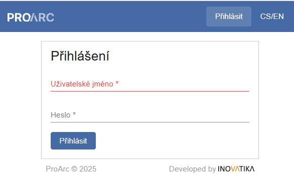

# Přihlášení a hlavní navigační lišta 

!!! note "Videonávod"
    <iframe 
    width="640" 
    height="360" 
    src="https://drive.google.com/file/d/1mBPFELS5GO12QsPdVw07NXm-ahiBr0bO/preview"
    allow="autoplay; encrypted-media" 
    frameborder="0" 
    allowfullscreen>
    </iframe>
    
---

Uživatelské prostředí systému ProArc je webový klient, který lze
spouštět v libovolném internetovém prohlížeči. Systém je však
optimalizován pro Google Chrome a Firefox.

Administrátor vám vytvoří uživatelský účet, přidělí iniciální heslo a
sdělí webovou adresu aplikace, na které se můžete snadno přihlásit:

{ width=500 align:center }

**Horní navigační lišta je dostupná ve všech částech aplikace a je rozdělena na**:

**1\. zpracovatelské funkce** - import, správa procesů, hledání, zakládání
nových objektů

**2\. informační a uživatelské funkce** - profil (nastavení), zařízení,
informace o verzi a jazykové nastavení.

Navigační lišta umožňuje přechod mezi jednotlivými funkcemi a oblastmi
systému. A také návrat do úložiště (pomocí tlačítka **Hledat** nebo
kliknutím na logo **PROARC**):

## Čas do vypršení přihlášení

Administrátor může v každé instanci ProArcu nastavit dobu nečinnosti, po
které budete automaticky odhlášeni.

Na základní liště se zobrazuje odpočet do automatického odhlášení. Tento
čas se při každé interakci s aplikací resetuje.
