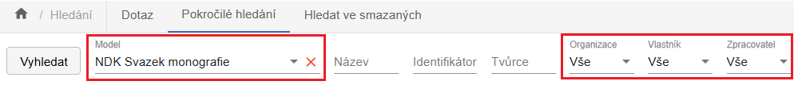
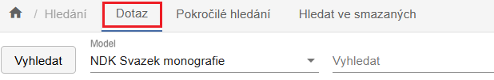
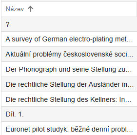
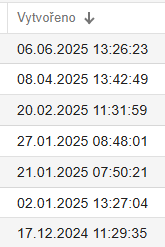

# Obrazovka úložiště a hledání

!!! note "Videonávod"
    <iframe 
    width="640" 
    height="360" 
    src="https://drive.google.com/file/d/18F2u5IqPNNBnFtambkucdtjvA_1JchlJ/preview"
    allow="autoplay; encrypted-media" 
    frameborder="0" 
    allowfullscreen>
    </iframe>
    
---

Po přihlášení se otevře hlavní přehledová obrazovka - **úložiště**.
Obrazovka je rozdělena do dvou horizontálních podoken. Objekt vybraný v
horním okně lze ve spodní části rozbalit do stromové struktury.

Každé podokno má vlastní lištu s operacemi, které můžete provádět nad
vybranými objekty. Některé operace (např. export, mazání) jsou dostupné
na více místech a jsou popsány v kontextu zakládání [konkrétních typů
dokumentů](../jak_zpracovat_dokument/typy_dokumentu.md).
Zobrazené údaje (sloupce) se mohou lišit podle individuálního nastavení
[vašeho profilu](../zakladni_prehled/07_profil.md).

## Hledání v úložišti

Dvouřádková lišta horní části úložiště umožňuje vyhledávání podle
různých kritérií a jejich kombinací.

### Pokročilé hledání

Ve výchozím stavu je aktivní režim **Pokročilé hledání**:

Pro efektivní hledání dodržujte následující pravidla:

- Vyhledávání podle polí s hodnotami z roletky (červeně označená pole)
  spusťte pomocí tlačítka **Vyhledat**.

- U polí pro volný text stačí stisknout klávesu **Enter**, a to i v
  kombinaci s vyplněnými roletkami.

- Výchozí hodnoty všech vyhledávacích polí jsou nastaveny na **Vše
  (all)**.

- Výjimkou je pole **Model** - zde si aplikace pamatuje naposledy
  použitou hodnotu.

- Roletková pole odpovídají přesně sloupcům v zobrazení.

- Po zadání hodnoty do pole se vpravo zobrazí červený křížek pro její
  vymazání.

- **Identifikátorem** se rozumí UUID objektu - zadejte ho přesně včetně
  prefixu (např. `uuid:178c7f50-7fe7-4a99-b942-ec7a67e006d3`). Použijte
  znak `*` pro částečné hledání (např. `*178*`).

- Při vyhledávání ve volném textu dbejte na správnou diakritiku.

- Velká a malá písmena se nerozlišují.

### Dotaz

Při použití volby **Dotaz** máte k dispozici jedno vyhledávací pole ve
spojení s vybraným modelem.

Do tohoto pole můžete zadat např.:

- název nebo podnázev (či jejich části),

- identifikátory (čárový kód, ČČNB, ISBN, ISSN, OCLC, UUID, URN:NBN),

- signaturu, ID katalogového záznamu (např. pole 001, sysno).

### Hledání ve smazaných

**Hledání ve smazaných** objektech funguje podobně jako Rozšířené
hledání, ale pracuje s jinou datovou množinou. Zatímco rozšířené hledání
prohledává aktivní objekty, hledání ve smazaných cílí na objekty
označené k vymazání. Tyto objekty se běžně nezobrazují, ale zůstávají v
databázi se speciálním příznakem.

!!! warning "Upozornění" 
    Při mazání se odstaňují vazby mezi objekty.

S nalezenými objekty můžete dál pracovat - např. je obnovit. Obnovit
lze zpravidla pouze horní úroveň objektu (např. bez připojených částí či
stran).

## Třídění v úložišti

Záznamy v horním okně úložiště můžete seřadit podle vybraného sloupce
kliknutím na záhlaví, na jeho název. Vedle názvu se zobrazí šipka
označující směr třídění (vzestupně/sestupně).

Vícenásobné třídění podle více sloupců není možné.

Příklad vzestupného setřídění podle názvu:

Příklad sestupného setřídění podle data vytvoření:

