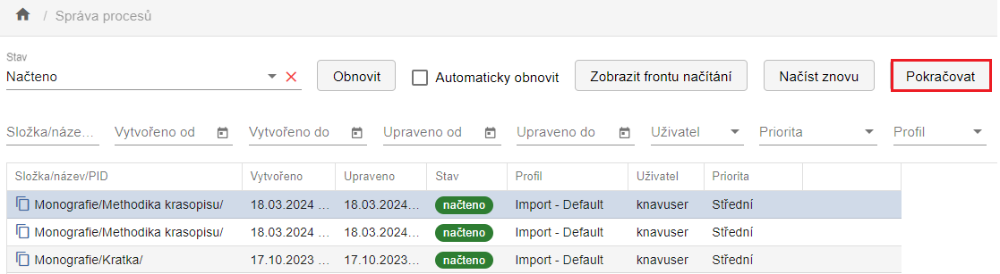

# Import a Správa procesů 

Každý uživatel má v ProArcu přiřazeny pracovní adresáře. O jejich
namapování informuje uživatele systémový administrátor.

Importní rozhraní vypadá následovně:

V poli **Profil** můžete zvolit profil
podle typu modelu. Pro textové dokumenty v NDK modelech se nejčastěji
využívá profil **Default**.

**Priorita** je ve výchozím stavu nastavena na **Střední**. Zvolíte-li
vyšší prioritu, bude se dávka ve frontě zpracovávat dříve než ostatní.
Jinak se zařadí na konec fronty.

V poli **Zařízení** lze vybrat přístroj, na kterém byla data připravena
(typicky skener). Výběr zařízení je pro většinu modelů povinný.
Tlačítko **Načíst** se aktivuje až po jeho zvolení.

Funkce **Generovat index stránek** je ve výchozím stavu zapnutá.
Zajišťuje automatické přiřazení indexů stránkám již během načítání.

Ikona šipky  slouží k opětovnému načtení
dávky, např. v případě vadného souboru. Před novým načtením ProArc
automaticky smaže pomocné soubory, které při předchozím importu
vytvořil.

Aktuální stav importu můžete sledovat ve **Správě procesů**. V případě
souběžného spuštění více dávek budete automaticky přesměrováni do
**Správy importních procesů**, kde si můžete **Zobrazit frontu
načítání**.

V tabulkovém zobrazení uvidíte průběh importu jednotlivých dávek.  
Aktuální stav lze ručně aktualizovat pomocí tlačítka **Obnovit**.

Jakmile je načítání dokončeno, daný proces zmizí z aktuálního
zobrazení.  
Je proto nutné kliknout na možnost **Zpět na seznam všech procesů**.

Ve Správě procesů můžete vyfiltrovat a zobrazit i jiný stav (např.
Načítání, Načteno, Exportováno atd. atd.) nebo využít filtrování podle
jiných parametrů.
