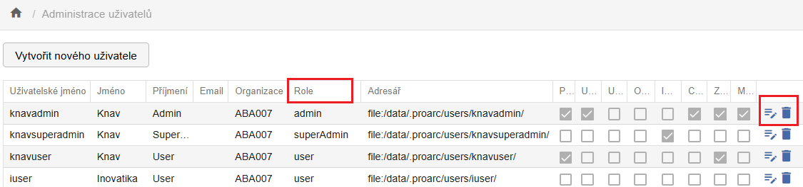
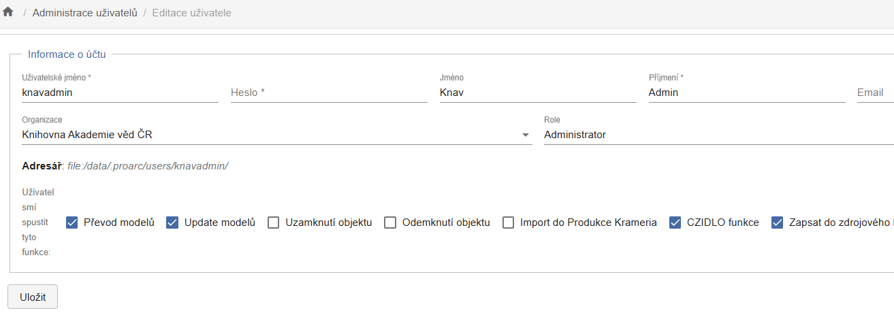

# Administrace

**Administrace** slouží ke správě uživatelů a jejich oprávnění.

Oprávnění jsou určena kombinací přidělené role (user, admin, superadmin)
a povolených funkcí (nastavovaných pomocí zaškrtávacích polí -
checkboxů).

!!! warning "Upozornění" 
    Uživatelé s rolí user funkci **Administrace** ve své liště nevidí.

V rámci této obrazovky můžete:

- vytvořit nového uživatele,

- odstranit uživatele,

- otevřít detailní nastavení uživatele.

V editačním okně lze upravit všechny parametry kromě adresáře - ten je
vytvořen automaticky při založení účtu uživatele a slouží k ukládání
importovaných dat nebo exportovaných souborů.

