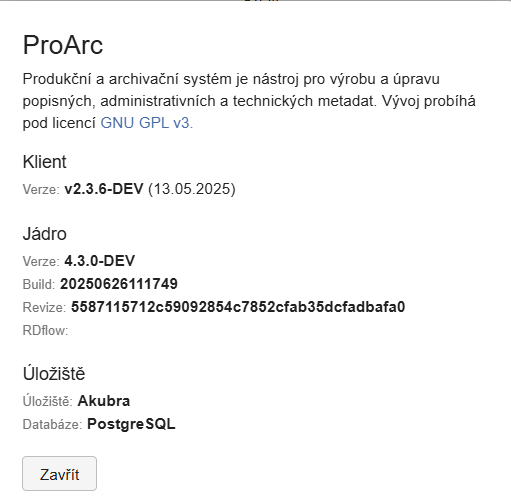

# O aplikaci

Funkce **O aplikaci** slouží pro zobrazení verzí jádra a klienta
nainstalovaných v konkrétní instanci systému.

Tuto informaci využijete např. při hlášení chyby na [GitHubu](https://github.com/proarc/proarc-client/issues), kde je potřeba
specifikovat, ve které verzi se problém vyskytl. Stejně tak pokud máte
testovací a produkční instanci, mohou se verze lišit.

