# Profil

Pod tlačítkem **Profil** najdete možnosti individuálního nastavení
prostředí a odhlášení z aplikace.

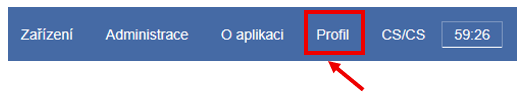

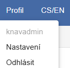

## Lokální nastavení

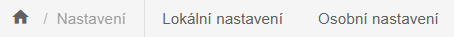

### Preferované hodnoty - typy stran, jazyk, identifikátory

V lokálním nastavení můžete nastavit **preferované typy stran**,
**jazyk** a **identifikátory**, které se poté zobrazují na začátku
výběrových seznamů ve formulářích.

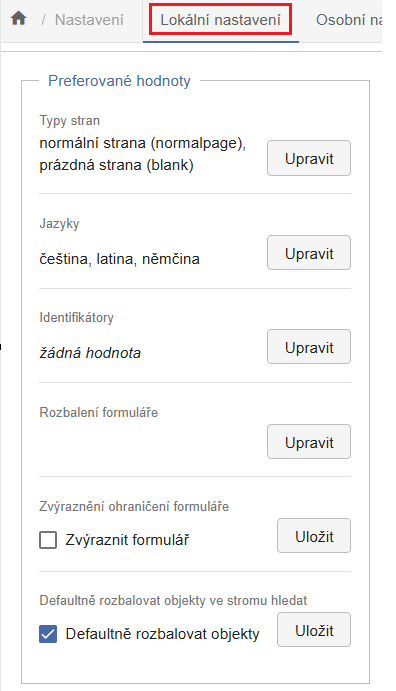{width=350 .center .bordered}

Po kliknutí na **Upravit** se zobrazí seznam všech dostupných hodnot
(např. typy stran). Vybrané hodnoty se po uložení přesunou na začátek
seznamu.

Ve formuláři (např. NDK strany) se preferované hodnoty zobrazí stejně v
horní části seznamu, ještě nad abecedním pořadí:

{width=300 .center .bordered}

V seznamu hodnot ve formuláři NDK strany pak je k dispozici stejně
uspořádaný seznam:

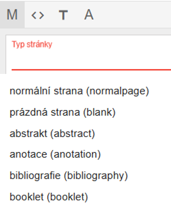{width=250 .center .bordered}

### Rozbalení formuláře

Ve výchozím stavu zůstávají prázdná pole formuláře sbalená, což zlepšuje
přehlednost - zejména při práci s daty z katalogu, kdy jsou manuální
vstupy minimální.

Povinná pole (např. název) jsou vždy rozbalená a v případě chybějící
hodnoty zvýrazněná červeně.

Pokud často zadáváte metadata ručně, doporučujeme zapnout rozbalování
polí při založení objektu. Toto nastavení lze definovat pro konkrétní
modely (např. NDK svazek monografie). Po uložení se model přesune na
začátek seznamu.

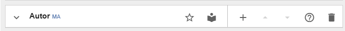

V nastavení označíme, že chceme formulář při založení objektu NDK svazek
monografie plně rozbalený. Po uložení se tento model přesune na začátek
seznamu dostupných modelů:

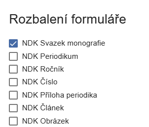{width=250 .center .bordered}

Pole pro autora se pak rozbalí již při založení nového objektu, i když
je prázdné:

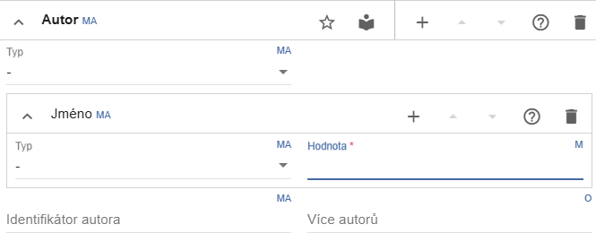

### Zvýraznění ohraničení formuláře

Standardně nejsou rámečky jednotlivých polí zvýrazněné a jejich barva je
světle šedá.

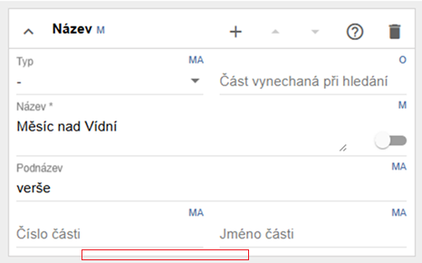

Po zapnutí zvýraznění jsou rámečky výraznější, což usnadňuje orientaci
ve formuláři při práci s větším množstvím dat.

### Defaultně rozbalovat objekty

Pokud není toto nastavení aktivní, spodní podokno úložiště nezobrazuje
automaticky nejnižší úroveň stromové struktury (např. strany u
dokumentů). Pro zobrazení musíte kliknout na „zobáček" nebo použít
funkci **Rozbalit**.

Zapnutím tohoto nastavení zrychlíte práci, zejména u rozsáhlých
dokumentů nebo při nižším výkonu systému.

{width=400}

Ve výchozím stavu je toto rozbalování aktivní, v úložišti je pak
zobrazena i nejnižší úroveň struktury včetně stran.

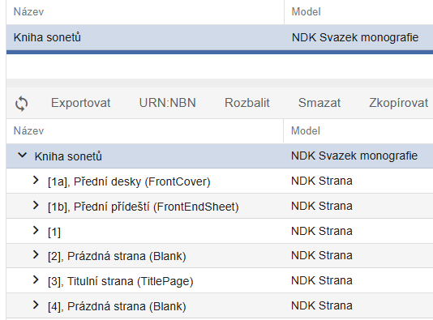{width=400}

### Výběr sloupců

Ve všech přehledových obrazovkách (např. úložiště, import, správa
procesů) můžete upravit zobrazení sloupců a jejich pořadí.

Způsob nastavení sloupců je stejný pro následující přehledové obrazovky:

- Hledat = horní okno úložiště

- Hledat (strom) = dolní okno úložiště

- Editace v importu

- Správa procesů

- Správa procesů (fronta načítání)

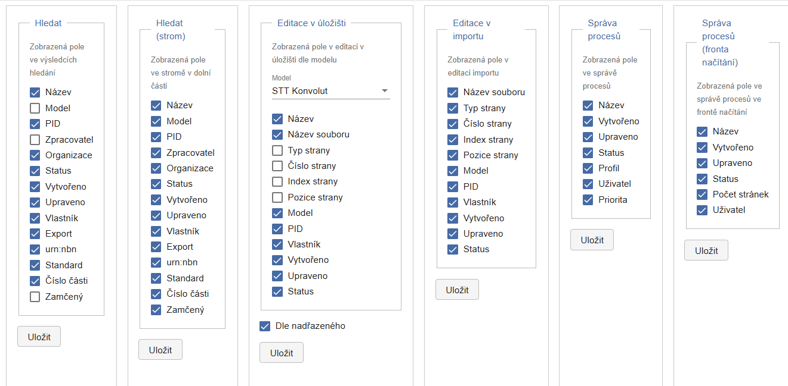

Pro jednotlivé obrazovky je v nastavení seznam všech polí (sloupců),
která jsou v ní k dispozici, standardně jsou všechna označena jako
zobrazovaná.

Pro změnu nastavení konkrétní obrazovky označte jen ta pole, která
chcete zobrazovat a uložte. Pokud chcete upravit i pořadí sloupců,
klikněte na vybrané pole levým tlačítkem myši, přetáhněte je na
požadovanou pozici a opět uložte.

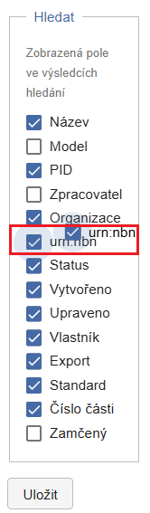

Nastavení pro **Editaci v úložišti** vyžaduje nejprve výběr modelu.

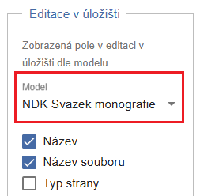

Sloupce lze upravovat i přímo v některých obrazovkách - příslušná volba
je dostupná na liště pod ikonou **tří teček**.

Dolní okno úložiště:

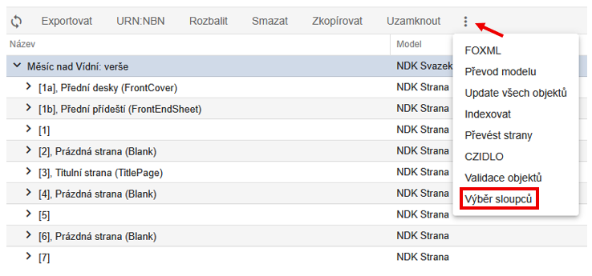
Editace v úložišti:

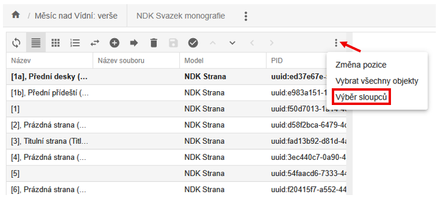

Editace v importu:

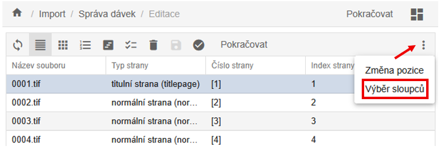

## Nastavení - Osobní nastavení

V sekci **Osobní nastavení** můžete upravit pouze ty hodnoty, které jsou
v polích otevřených pro editaci, jsou to jméno, příjmení a heslo.

Tlačítko **Uložit** se aktivuje pouze po změně některého z údajů.

Uživatelé s rolí user mohou změnit heslo pouze zde (nikoli v
Administraci, která pro ně není přístupná).

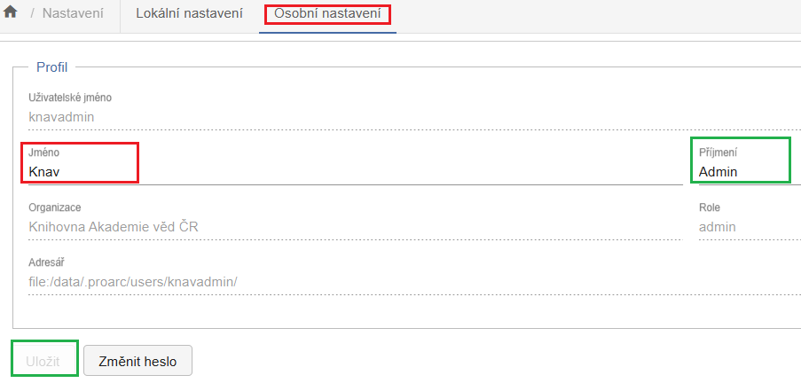