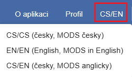
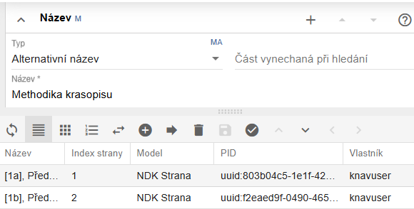
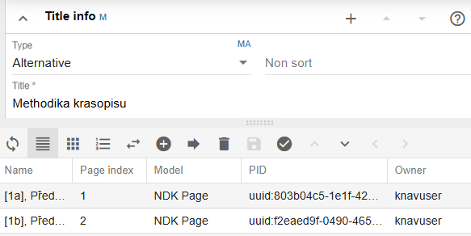
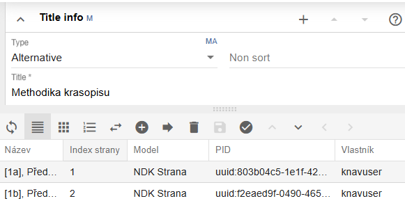

# Nastavení jazyka

ProArc podporuje tři jazykové varianty:

- **CS/CS** - české rozhraní + české názvy polí a hodnot,

- **EN/EN** - anglické rozhraní + anglické názvy polí a hodnot,

- **CS/EN** - české rozhraní + anglické názvy polí a hodnot (odpovídají
  elementům a hodnotám v metadatech podle standardu Národní knihovny).

Jazyk si můžete zvolit již na přihlašovací obrazovce, nebo kdykoli
změnit přímo v aplikaci bez nutnosti se odhlásit.

**CS/CS** - při této volbě je v češtině jak celé prostředí aplikace
(lišty, funkce, procesy a jejich dialogová oznámení\...), tak popisy
polí ve formulářích a seznamy povolených hodnot jednotlivých polí
formulářů.

**EN/EN** - je analogií varianty CS/CS, zde je vše v angličtině:

**CS/EN** - v této kombinaci je prostředí v češtině, pouze označení
polí ve formulářích a seznamy povolných hodnot v polích jsou
v angličtině, tj. tyto termíny odpovídají názvům elementů a hodnotám
uloženým v metadatech (MODS) a tomu, jak jsou popsány ve standardu
Národní knihovny.

